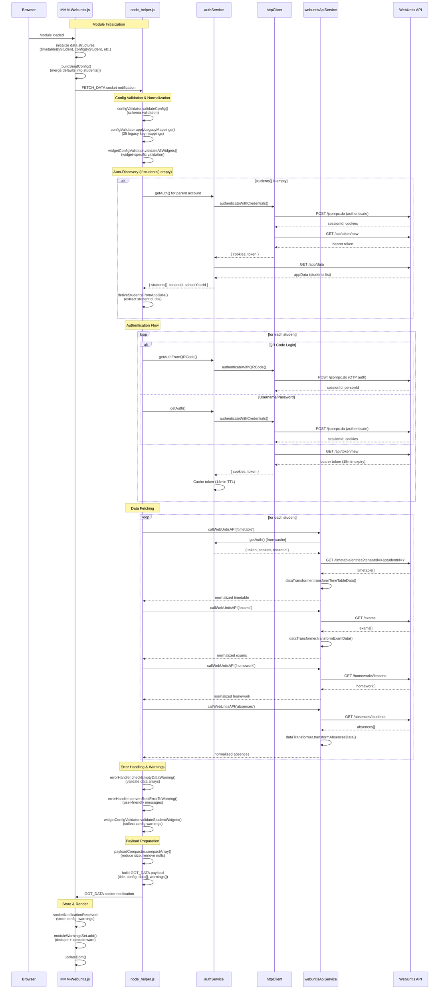

# MMM-Webuntis Architecture & Data Flow

## System Overview

```mermaid
graph TB
    subgraph Frontend["🖥️ Frontend (Browser)"]
        MM["MagicMirror Core"]
        FE["MMM-Webuntis.js"]
        Widgets["Widgets<br/>(lessons/grid/exams<br/>homework/absences)"]
        Util["widgets/util.js<br/>(formatDate, helpers)"]
    end

    subgraph Backend["⚙️ Backend (Node.js)"]
        NH["node_helper.js<br/>(Coordinator)"]

        subgraph Services["🔧 Services (lib/)"]
            HttpClient["httpClient.js<br/>(Generic HTTP)"]
            Auth["authService.js<br/>(Auth & Tokens)"]
            API["webuntisApiService.js<br/>(API Calls)"]
            Cache["cacheManager.js<br/>(TTL Cache)"]
            Transform["dataTransformer.js<br/>(Data Transform)"]
            Config["configValidator.js<br/>(Config & Legacy)"]
            Errors["errorHandler.js<br/>(Error Handling)"]
            Validators["widgetConfigValidator.js<br/>(Widget Validation)"]
            DateTime["dateTimeUtils.js<br/>(Date/Time Utils)"]
            Logger["logger.js<br/>(Backend Logging)"]
        end
    end

    subgraph External["🌐 External APIs"]
        REST["WebUntis REST API<br/>(/app/data, /timetable<br/>/exams, /homework<br/>/absences)"]
        JSONRPC["JSON-RPC API<br/>(auth, OTP)"]
    end

    MM <-->|socketNotification| FE
    FE <-->|sendSocketNotification| NH
    FE --> Widgets
    Widgets --> Util
    NH --> Services
    HttpClient --> JSONRPC
    Auth --> HttpClient
    API --> REST
    NH --> REST
```



## Modular Architecture (lib/)

The module uses a **service-oriented architecture** with specialized modules in the `lib/` directory:

### Core Services

**httpClient.js** - Generic HTTP client for WebUntis API
- QR code authentication (JSON-RPC with OTP)
- Username/password authentication (JSON-RPC)
- Bearer token retrieval
- Session cookie management
- Session caching (14-minute TTL)
- **Independence**: No WebUntis library dependency for HTTP operations

**authService.js** - Authentication and token management
- REST API authentication (bearer tokens + cookies)
- QR code authentication flow
- Parent account authentication
- Token caching (14-minute TTL, 1-minute buffer)
- School/server resolution from QR codes
- Multi-student target building
- **Dependencies**: httpClient.js, axios (for app/data)

**webuntisApiService.js** - Unified API client
- Generic REST API call function
- Timetable, exams, homework, absences, messages of day
- Request/response handling
- Error propagation
- **Dependencies**: restClient.js, authService.js

### Data Processing

**dataTransformer.js** - Data transformation and normalization
- Timetable data transformation
- Exam, homework, absences transformation
- HTML sanitization
- Date/time normalization
- **Dependencies**: None (pure functions)

**cacheManager.js** - TTL-based caching
- Class ID caching
- Generic key-value cache with expiration
- Cache statistics and cleanup
- **Dependencies**: None

**dateTimeUtils.js** - Date and time utilities
- Date calculations (addDays, daysBetween)
- Time formatting (toMinutes, formatTime)
- Date comparisons (isToday, isBefore, isAfter)
- YYYYMMDD formatting for API calls
- **Dependencies**: None (pure functions)

### Configuration & Validation

**configValidator.js** - Configuration validation and legacy mapping
- Schema-based validation
- 25 legacy config key mappings
- Detailed deprecation warnings
- Config normalization
- **Dependencies**: None

**widgetConfigValidator.js** - Widget-specific validation
- Grid, lessons, exams, homework, absences, messages validation
- Range validation (nextDays: 0-365, pastDays: 0-90)
- Student credential validation
- Student widget overrides validation
- **Dependencies**: None

### Error Handling & Logging

**errorHandler.js** - Centralized error handling
- Error formatting
- REST error to user-friendly warning conversion
- Empty data warnings
- Error severity classification (critical/warning/info)
- Retry-after header extraction
- Retryable error detection
- **Dependencies**: None

**logger.js** - Backend logging service
- Configurable log levels (none/error/warn/info/debug)
- Structured logging with student context
- MagicMirror logger integration
- **Dependencies**: MagicMirror logger

## Detailed Data Flow

### 1. **Initialization Phase** (`start()`)



### 2. **Configuration Normalization** (Backend Only)


### 3. **Widget Rendering Pipeline**


### 4. **REST API Request Flow** (per data type)


### 5. **Caching Strategy**


### 6. **Configuration Merging & Inheritance**


### 7. **Warning Collection & Propagation**

```mermaid
graph TD
    V1["Validate studentId<br/>against app/data"]
    --> W1{Valid?}
    W1 -->|No| A1["Attach warning<br/>to student.__warnings<br/>Log warn()"]

    V2["Validate title match<br/>when no studentId"]
    --> W2{Match found?}
    W2 -->|No| A2["Add candidate IDs<br/>to warning message"]

    A1 --> C["Collect all warnings<br/>into array"]
    A2 --> C
    C --> D["Dedupe warnings<br/>(Set)"]
    D --> P["Attach to GOT_DATA<br/>payload.warnings"]
    P --> FE["Send to Frontend"]
    FE --> MW["moduleWarningsSet<br/>(dedupe + console.warn)"]
    MW --> UI["Render above widgets<br/>⚠️ message per warning"]

    style A1 fill:#ffcdd2
    style A2 fill:#ffcdd2
    style UI fill:#ffeb3b
```



## Key Function Relationships

### **Backend (`node_helper.js`)**

| Function | Purpose | Called by | Calls |
|----------|---------|-----------|-------|
| `start()` | Initialize caches & timers | MagicMirror | `_startCacheCleanup()` |
| `socketNotificationReceived()` | Entry point for FETCH_DATA | Frontend | `_ensureStudentsFromAppData()`, `processGroup()` |
| `_ensureStudentsFromAppData()` | Auto-discover students if empty | `socketNotificationReceived()` | `_getRestAuthTokenAndCookies()`, `_deriveStudentsFromAppData()`, `_normalizeLegacyConfig()` |
| `_normalizeLegacyConfig()` | Map old config keys → new | `_ensureStudentsFromAppData()`, `processGroup()` | — |
| `processGroup()` | Process credential group | `socketNotificationReceived()` | `_createUntisClient()`, `fetchData()` |
| `fetchData()` | Main data fetch orchestration | `processGroup()` | `_getTimetableViaRest()`, `_getExamsViaRest()`, etc. |
| `_getTimetableViaRest()` | Fetch timetable via REST | `fetchData()` | `_callRest()`, `_normalizeDateToInteger()` |
| `_getExamsViaRest()` | Fetch exams | `fetchData()` | `_callRest()`, `_compactExams()` |
| `_getHomeworkViaRest()` | Fetch homework | `fetchData()` | `_callRest()` |
| `_getAbsencesViaRest()` | Fetch absences | `fetchData()` | `_callRest()` |
| `_getRestAuthTokenAndCookies()` | Obtain & cache auth token | Data fetch functions | REST (via axios) |
| `_createUntisClient()` | Create WebUntis client | `processGroup()` | — |
| `_compact*()` | Reduce payload size | `fetchData()` | — |

### **Frontend (`MMM-Webuntis.js`)**

| Function | Purpose | Called by | Calls |
|----------|---------|-----------|-------|
| `start()` | Initialize module | MagicMirror | `_buildSendConfig()`, `sendSocketNotification('FETCH_DATA')` |
| `_buildSendConfig()` | Merge defaults into students | `start()`, `_startFetchTimer()` | — |
| `socketNotificationReceived()` | Receive GOT_DATA from backend | Backend | `_scheduleDomUpdate()` |
| `getDom()` | Render all widgets | MagicMirror | `_getDisplayWidgets()`, `_renderWidgetTableRows()` |
| `_renderWidgetTableRows()` | Render per-student tables | `getDom()` | `_invokeWidgetRenderer()` |
| `_invokeWidgetRenderer()` | Call widget renderer | `_renderWidgetTableRows()` | Widgets (`lessons.js`, `grid.js`, etc.) |
| `_filterTimetableRange()` | Apply date filters | Widgets | — |
| `_toMinutes()` | Convert time format | Widgets | — |
| `_scheduleDomUpdate()` | Debounce DOM updates | `socketNotificationReceived()` | — |

## Data Structures

### **GOT_DATA Payload**

```javascript
{
  title: "Student Name",              // per-student identifier
  id: "module-instance-id",           // MagicMirror module ID
  config: {                           // normalized student config
    studentId: 1234,
    title: "Student Name",
    daysToShow: 7,
    examsDaysAhead: 15,
    absencesPastDays: 21,
    __warnings: ["studentId not found in app/data. Possible: 456, 789"]
  },
  timeUnits: [                        // lesson time slots (grid)
    { startTime: "08:00", endTime: "09:00", name: "1. Stunde" }
  ],
  timetableRange: [                   // lessons for date range
    { date: 20251226, startTime: "08:00", subject: "Math", ... }
  ],
  exams: [                            // upcoming exams
    { date: 20260110, subject: "Math", teacher: "Dr. X", ... }
  ],
  homeworks: [                        // homework items
    { dueDate: "20260115", subject: "Math", title: "Ex 1-5", ... }
  ],
  absences: [                         // absence records
    { date: 20251220, excused: true, ... }
  ],
  holidays: [                         // all holiday periods
    { id: 1, name: "Xmas", longName: "Christmas", startDate: 20251223, endDate: 20260105 }
  ],
  holidayByDate: {                    // pre-computed holiday lookup by YMD
    20251226: { id: 1, name: "Xmas", longName: "Christmas", ... },
    20251227: { id: 1, name: "Xmas", longName: "Christmas", ... }
  },
  currentHoliday: {                   // active holiday for today (or null)
    id: 1, name: "Xmas", longName: "Christmas", startDate: 20251223, endDate: 20260105
  },
  warnings: [                         // top-level deduped warnings
    "Configured studentId 7777 ... Possible studentIds: 1234, 5678"
  ]
}
```

### **Module Config Structure**

```javascript
{
  // === GLOBAL OPTIONS ===
  header: "MMM-Webuntis",                  // module title in MagicMirror
  fetchIntervalMs: 900000,                 // fetch interval (15 min default)
  logLevel: "none",                        // "error", "warn", "info", "debug"

  // === DISPLAY OPTIONS ===
  displayMode: "list",                     // "list", "grid", or comma-separated widgets:
                                           // "lessons,exams,grid,homework,absences,messagesofday"
  mode: "verbose",                         // "verbose" (per-student) or "compact" (combined)

  // === TIMETABLE FETCH RANGE ===
  // Preferred: nextDays/pastDays. Legacy: daysToShow/pastDaysToShow still supported
  nextDays: 7,                            // upcoming days to fetch/display
  pastDays: 0,                            // past days to include
  debugDate: null,                        // YYYY-MM-DD to freeze "today" for testing

  // === PARENT ACCOUNT CREDENTIALS (optional) ===
  // Global credentials for parent account access to multiple children
  username: "parent@example.com",         // parent WebUntis username
  password: "password",                   // parent WebUntis password
  school: "school_name",                  // WebUntis school identifier
  server: "webuntis.com",                 // WebUntis server hostname

  // === DEBUG OPTIONS ===
  dumpBackendPayloads: false,             // dump API responses to debug_dumps/

  // === WIDGET-SPECIFIC OPTIONS ===
  // Per-widget namespaces (preferred modern structure)
  lessons: {
    dateFormat: "EEEE",                   // date display format
    showStartTime: false,                 // show lesson start time
    showRegular: false,                   // show regular lessons
    useShortSubject: false,               // use short subject names
    showTeacherMode: "full",              // "off", "initial", "full"
    showSubstitution: false,              // show substitution text
    nextDays: 7,                          // (optional) widget-specific days ahead
  },

  grid: {
    dateFormat: "EEE dd.MM.",             // date display format
    mergeGap: 15,                         // merge lessons with gap <= N minutes
    maxLessons: 0,                        // max lessons to display (0 = unlimited)
    showNowLine: true,                    // show current time indicator
    nextDays: 1,                          // (optional) widget-specific days ahead
    pastDays: 0,                          // (optional) widget-specific days past
  },

  exams: {
    dateFormat: "dd.MM.",                 // date display format
    daysAhead: 45,                        // days ahead to fetch exams
    showSubject: true,                    // show exam subject
    showTeacher: true,                    // show exam teacher
  },

  homework: {
    dateFormat: "dd.MM.",                 // date display format
    showSubject: true,                    // show subject name
    showText: true,                       // show homework description
    nextDays: 28,                         // (optional) widget-specific days ahead
    pastDays: 1,                          // (optional) widget-specific days past
  },

  absences: {
    dateFormat: "dd.MM.",                 // date display format
    pastDays: 20,                         // days in past to show absences
    futureDays: 20,                       // days in future to show absences
    showDate: true,                       // show absence date
    showExcused: true,                    // show excused/unexcused status
    showReason: true,                     // show reason for absence
    maxItems: null,                       // max entries to show (null = unlimited)
  },

  messagesofday: {
    dateFormat: "dd.MM.",                 // date display format
  },

  // === LEGACY OPTIONS (deprecated but still supported) ===
  // Legacy top-level options (use widget namespaces instead)
  daysToShow: 7,                          // → nextDays
  pastDaysToShow: 0,                      // → pastDays
  examsDaysAhead: 21,                     // → exams.daysAhead
  absencesPastDays: 21,                   // → absences.pastDays
  mergeGapMinutes: 15,                    // → grid.mergeGap

  // === STUDENTS ===
  students: [
    {
      title: "Student Name",              // display name
      studentId: 1234,                    // student ID (parent account mode)

      // QR Code login (alternative to credentials)
      qrcode: "untis://setschool?url=https://...",

      // OR direct student credentials
      username: "student@example.com",
      password: "password",
      school: "school_name",
      server: "webuntis.com"
    }
  ]
}
```

## Error Handling & Warnings

```mermaid
graph TD
    A["REST Request"]
    --> B{HTTP Status}

    B -->|200| C["Parse & normalize"]
    B -->|4xx/5xx| D["Log error, return []"]

    C --> E{Validation}
    E -->|studentId invalid| F["Add warning<br/>Include candidates"]
    E -->|OK| G["Return data[]"]

    F --> H["Attach to payload.config.__warnings"]
    G --> H

    H --> I["Collect top-level warnings"]
    I --> HOL{"Is today<br/>a holiday?"}
    HOL -->|Yes| SKIP["Suppress 'no lessons'<br/>warning"]
    HOL -->|No| J["Dedupe & send in GOT_DATA.warnings"]
    SKIP --> J
    J --> K["Frontend console.warn()"]
    K --> L["Render ⚠️ message in UI"]

    style D fill:#ffcdd2
    style F fill:#fff9c4
    style L fill:#ffeb3b
```



## Performance Optimizations

1. **Response Caching** (30s TTL): Avoid duplicate REST calls within 30 seconds
2. **Auth Token Caching** (14min TTL): Reuse bearer tokens; refresh only when expired
3. **Class ID Cache**: Cache resolved class IDs per credential+class combination
4. **Payload Compaction**: Reduce socket message size via `_compact*()` functions
5. **Debounced DOM Updates**: Coalesce multiple `GOT_DATA` into single DOM render
6. **Credential Grouping**: Batch students by shared credentials to minimize login/logout cycles

## Testing & Debugging

```bash
# Interactive CLI (test config + fetch)
node cli/cli.js

# Debug script (single fetch cycle)
npm run debug

# Check linting
node --run lint

# View debug payloads
cat debug_dumps/*.json | jq

# Enable detailed logging in config
logLevel: "debug"           # MagicMirror console
dumpBackendPayloads: true   # Write GOT_DATA to debug_dumps/
```
