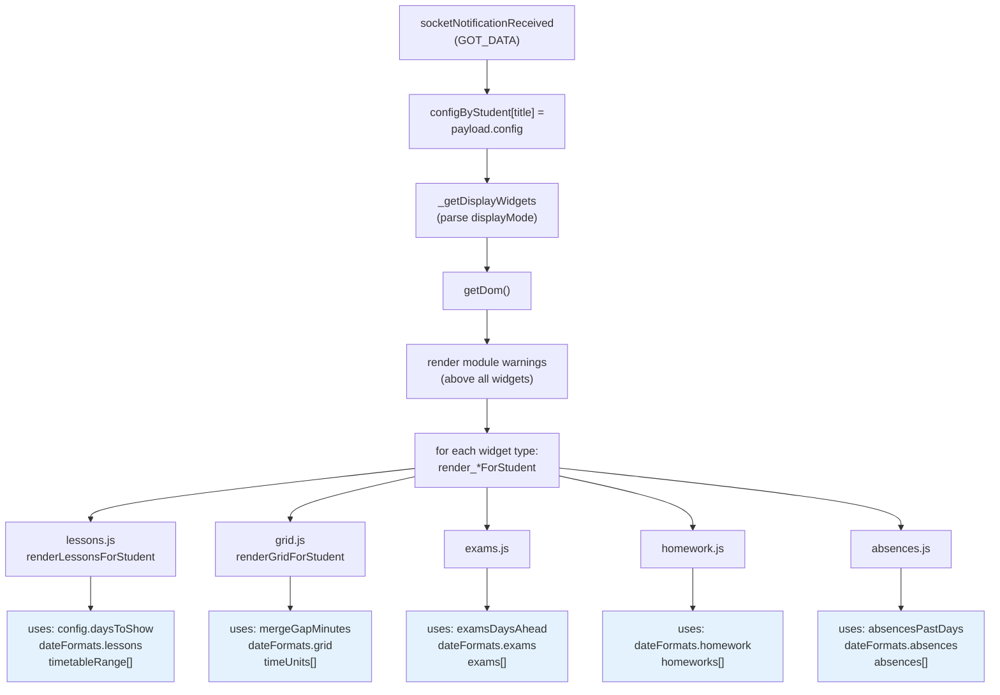

# MMM-Webuntis Architecture & Data Flow

## System Overview


## Detailed Data Flow

### 1. **Initialization Phase** (`start()`)


### 2. **Configuration Normalization** (Backend Only)


### 3. **Widget Rendering Pipeline**



### 4. **REST API Request Flow** (per data type)


### 5. **Caching Strategy**


### 6. **Configuration Merging & Inheritance**


### 7. **Warning Collection & Propagation**

```mermaid
graph TD
    V1["Validate studentId<br/>against app/data"]
    --> W1{Valid?}
    W1 -->|No| A1["Attach warning<br/>to student.__warnings<br/>Log warn()"]

    V2["Validate title match<br/>when no studentId"]
    --> W2{Match found?}
    W2 -->|No| A2["Add candidate IDs<br/>to warning message"]

    A1 --> C["Collect all warnings<br/>into array"]
    A2 --> C
    C --> D["Dedupe warnings<br/>(Set)"]
    D --> P["Attach to GOT_DATA<br/>payload.warnings"]
    P --> FE["Send to Frontend"]
    FE --> MW["moduleWarningsSet<br/>(dedupe + console.warn)"]
    MW --> UI["Render above widgets<br/>⚠️ message per warning"]

    style A1 fill:#ffcdd2
    style A2 fill:#ffcdd2
    style UI fill:#ffeb3b
```



## Key Function Relationships

### **Backend (`node_helper.js`)**

| Function | Purpose | Called by | Calls |
|----------|---------|-----------|-------|
| `start()` | Initialize caches & timers | MagicMirror | `_startCacheCleanup()` |
| `socketNotificationReceived()` | Entry point for FETCH_DATA | Frontend | `_ensureStudentsFromAppData()`, `processGroup()` |
| `_ensureStudentsFromAppData()` | Auto-discover students if empty | `socketNotificationReceived()` | `_getRestAuthTokenAndCookies()`, `_deriveStudentsFromAppData()`, `_normalizeLegacyConfig()` |
| `_normalizeLegacyConfig()` | Map old config keys → new | `_ensureStudentsFromAppData()`, `processGroup()` | — |
| `processGroup()` | Process credential group | `socketNotificationReceived()` | `_createUntisClient()`, `fetchData()` |
| `fetchData()` | Main data fetch orchestration | `processGroup()` | `_getTimetableViaRest()`, `_getExamsViaRest()`, etc. |
| `_getTimetableViaRest()` | Fetch timetable via REST | `fetchData()` | `_callRest()`, `_normalizeDateToInteger()` |
| `_getExamsViaRest()` | Fetch exams | `fetchData()` | `_callRest()`, `_compactExams()` |
| `_getHomeworkViaRest()` | Fetch homework | `fetchData()` | `_callRest()` |
| `_getAbsencesViaRest()` | Fetch absences | `fetchData()` | `_callRest()` |
| `_getRestAuthTokenAndCookies()` | Obtain & cache auth token | Data fetch functions | REST (via axios) |
| `_createUntisClient()` | Create WebUntis client | `processGroup()` | — |
| `_compact*()` | Reduce payload size | `fetchData()` | — |

### **Frontend (`MMM-Webuntis.js`)**

| Function | Purpose | Called by | Calls |
|----------|---------|-----------|-------|
| `start()` | Initialize module | MagicMirror | `_buildSendConfig()`, `sendSocketNotification('FETCH_DATA')` |
| `_buildSendConfig()` | Merge defaults into students | `start()`, `_startFetchTimer()` | — |
| `socketNotificationReceived()` | Receive GOT_DATA from backend | Backend | `_scheduleDomUpdate()` |
| `getDom()` | Render all widgets | MagicMirror | `_getDisplayWidgets()`, `_renderWidgetTableRows()` |
| `_renderWidgetTableRows()` | Render per-student tables | `getDom()` | `_invokeWidgetRenderer()` |
| `_invokeWidgetRenderer()` | Call widget renderer | `_renderWidgetTableRows()` | Widgets (`lessons.js`, `grid.js`, etc.) |
| `_filterTimetableRange()` | Apply date filters | Widgets | — |
| `_toMinutes()` | Convert time format | Widgets | — |
| `_scheduleDomUpdate()` | Debounce DOM updates | `socketNotificationReceived()` | — |

## Data Structures

### **GOT_DATA Payload**

```javascript
{
  title: "Student Name",              // per-student identifier
  id: "module-instance-id",           // MagicMirror module ID
  config: {                           // normalized student config
    studentId: 1234,
    title: "Student Name",
    daysToShow: 7,
    examsDaysAhead: 15,
    absencesPastDays: 21,
    dateFormats: { lessons: "EEE", grid: "EEE dd.MM.", ... },
    __warnings: ["studentId not found in app/data. Possible: 456, 789"]
  },
  timeUnits: [                        // lesson time slots (grid)
    { startTime: "08:00", endTime: "09:00", name: "1. Stunde" }
  ],
  timetableRange: [                   // lessons for date range
    { date: 20251226, startTime: "08:00", subject: "Math", ... }
  ],
  exams: [                            // upcoming exams
    { date: 20260110, subject: "Math", teacher: "Dr. X", ... }
  ],
  homeworks: [                        // homework items
    { dueDate: "20260115", subject: "Math", title: "Ex 1-5", ... }
  ],
  absences: [                         // absence records
    { date: 20251220, excused: true, ... }
  ],
  warnings: [                         // top-level deduped warnings
    "Configured studentId 7777 ... Possible studentIds: 1234, 5678"
  ]
}
```

### **Module Config Structure**

```javascript
{
  // Display
  displayMode: "lessons, exams, grid",     // which widgets to render
  mode: "verbose",                          // "verbose" or "compact"

  // Fetch Range
  daysToShow: 7,                            // days to fetch
  pastDaysToShow: 0,

  // Widget Options
  examsDaysAhead: 21,
  absencesPastDays: 21,
  mergeGapMinutes: 15,

  // Date Formatting
  dateFormats: {
    default: "dd.MM.",
    lessons: "EEE",
    grid: "EEE dd.MM.",
    exams: "dd.MM.",
    homework: "dd.MM.",
    absences: "dd.MM."
  },

  // Credentials (parent account or global)
  username: "email@example.com",
  password: "password",
  school: "school-name",
  server: "webuntis.com",

  // Students
  students: [
    {
      title: "Alice",
      studentId: 1234,              // parent account mode
      // OR
      qrcode: "untis://...",        // QR login mode
      // OR
      username: "alice@...",        // direct student login mode
      password: "pass",
      school: "...",
      server: "..."
    }
  ]
}
```

## Error Handling & Warnings

```mermaid
graph TD
    A["REST Request"]
    --> B{HTTP Status}

    B -->|200| C["Parse & normalize"]
    B -->|4xx/5xx| D["Log error, return []"]

    C --> E{Validation}
    E -->|studentId invalid| F["Add warning<br/>Include candidates"]
    E -->|OK| G["Return data[]"]

    F --> H["Attach to payload.config.__warnings"]
    G --> H

    H --> I["Collect top-level warnings"]
    I --> J["Dedupe & send in GOT_DATA.warnings"]
    J --> K["Frontend console.warn()"]
    K --> L["Render ⚠️ message in UI"]

    style D fill:#ffcdd2
    style F fill:#fff9c4
    style L fill:#ffeb3b
```



## Performance Optimizations

1. **Response Caching** (30s TTL): Avoid duplicate REST calls within 30 seconds
2. **Auth Token Caching** (14min TTL): Reuse bearer tokens; refresh only when expired
3. **Class ID Cache**: Cache resolved class IDs per credential+class combination
4. **Payload Compaction**: Reduce socket message size via `_compact*()` functions
5. **Debounced DOM Updates**: Coalesce multiple `GOT_DATA` into single DOM render
6. **Credential Grouping**: Batch students by shared credentials to minimize login/logout cycles

## Testing & Debugging

```bash
# Interactive CLI (test config + fetch)
node cli/cli.js

# Debug script (single fetch cycle)
npm run debug

# Check linting
node --run lint

# View debug payloads
cat debug_dumps/*.json | jq

# Enable detailed logging in config
logLevel: "debug"           # MagicMirror console
dumpBackendPayloads: true   # Write GOT_DATA to debug_dumps/
```
