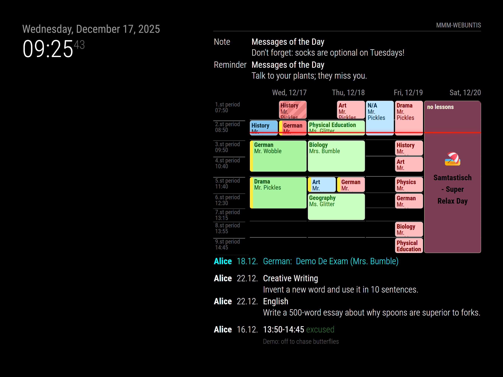
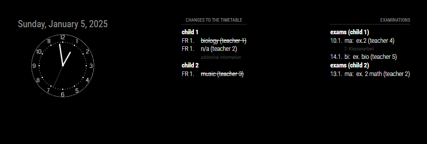

# MMM-Webuntis

> ⚠️ **Disclaimer / Haftungsausschluss**:
>
> **English:** This project is **not** an official Untis product, is **not** affiliated with, endorsed by, or supported by Untis GmbH or any of its subsidiaries. WebUntis is a registered trademark of Untis GmbH. This is an independent, community-developed module for MagicMirror² that interfaces with WebUntis APIs. Use at your own risk.
>
> **Deutsch:** Dieses Projekt ist **kein** offizielles Untis-Produkt und steht in **keiner** Verbindung zu Untis GmbH oder deren Tochtergesellschaften. Es wird **nicht** von Untis unterstützt oder empfohlen. WebUntis ist eine eingetragene Marke der Untis GmbH. Dies ist ein unabhängiges, von der Community entwickeltes Modul für MagicMirror², das die WebUntis-APIs nutzt. Nutzung auf eigene Gefahr.

> ⚠️ **Important Notice**:
>
> This project contains substantial AI-generated code. Review, test, and audit all files, web UI, and documentation before using it in production or safety-relevant contexts. Treat defaults and generated logic as untrusted until verified.

A MagicMirror² module that displays WebUntis timetables, exams, homework, and absences.

## Installation

```bash
cd ~/MagicMirror/modules
git clone https://github.com/HeikoGr/MMM-Webuntis
cd MMM-Webuntis
npm ci --omit=dev
```

## Update

```bash
cd ~/MagicMirror/modules/MMM-Webuntis
git pull
npm ci --omit=dev
```

## Authentication Methods

MMM-Webuntis supports two authentication methods for both student and parent accounts:

### 1. QR Code Login

**Available for:** Students and Parents

**How to get QR code:**
1. Open WebUntis app or website
2. Go to Account → Data Access
3. Generate QR code for this app
4. Copy the `untis://...` URL

**Student account:**
```javascript
{
  module: "MMM-Webuntis",
  position: "top_right",
  config: {
    students: [
      {
        title: "Alice",
        qrcode: "untis://setschool?url=myschool.webuntis.com&school=myschool&user=alice&key=ABC123..."
      }
    ]
  }
}
```

**Parent account (auto-discovery):**
```javascript
{
  module: "MMM-Webuntis",
  position: "top_right",
  config: {
    qrcode: "untis://setschool?url=myschool.webuntis.com&school=myschool&user=parent&key=XYZ789...",
    students: []  // Empty = auto-discover all children
  }
}
```

### 2. Direct Login (Username/Password)

**Available for:** Students and Parents

**Student account:**
```javascript
{
  module: "MMM-Webuntis",
  position: "top_right",
  config: {
    students: [
      {
        title: "Alice",
        username: "alice.smith",
        password: "student-password",
        school: "myschool",
        server: "myschool.webuntis.com"
      }
    ]
  }
}
```

**Parent account (auto-discovery):**
```javascript
{
  module: "MMM-Webuntis",
  position: "top_right",
  config: {
    username: "parent@example.com",
    password: "parent-password",
    school: "myschool",
    server: "myschool.webuntis.com",
    students: []  // Empty = auto-discover all children
  }
}
```

### Mixed Authentication

You can combine different authentication methods in one config:

```javascript
{
  module: "MMM-Webuntis",
  position: "top_right",
  config: {
    students: [
      {
        title: "Alice",
        qrcode: "untis://..."  // Student with QR code
      },
      {
        title: "Bob",
        username: "bob.jones",  // Student with direct login
        password: "password123",
        school: "myschool",
        server: "myschool.webuntis.com"
      }
    ]
  }
}
```

## Common Use Cases

### Week View (Monday-Friday)

```javascript
{
  module: "MMM-Webuntis",
  position: "top_right",
  config: {
    displayMode: "grid",
    grid: {
      weekView: true,  // Auto-shows Mon-Fri, advances on weekends
      maxLessons: 8,
    },
    students: [
      { title: "Alice", qrcode: "untis://..." }
    ]
  }
}
```

### Multiple Students (Same Family)

**Option 1: Parent account with auto-discovery**
```javascript
{
  module: "MMM-Webuntis",
  position: "top_left",
  config: {
    qrcode: "untis://...",  // Parent QR code
    students: []  // Auto-discovers all children
  }
}
```

**Option 2: Individual student accounts**
```javascript
{
  module: "MMM-Webuntis",
  position: "top_left",
  config: {
    students: [
      { title: "Alice", qrcode: "untis://..." },
      { title: "Bob", qrcode: "untis://..." }
    ]
  }
}
```

### Multiple Families (Separate Instances)

```javascript
// Family 1 - top left
{
  module: "MMM-Webuntis",
  position: "top_left",
  config: {
    header: "Family Schmidt",
    qrcode: "untis://...",  // Parent Schmidt QR code
    students: []
  }
},
// Family 2 - top right
{
  module: "MMM-Webuntis",
  position: "top_right",
  config: {
    header: "Family Müller",
    username: "mueller@example.com",  // Parent Müller login
    password: "password",
    school: "school",
    server: "school.webuntis.com",
    students: []
  }
}
```

## Widget Types

Set via `displayMode` (comma-separated):

- `grid` - Visual timetable grid
- `lessons` - List of upcoming lessons
- `exams` - Upcoming exams
- `homework` - Homework assignments
- `absences` - Absence records
- `messagesofday` - School announcements

**Example:**
```javascript
displayMode: "grid,exams,homework"
```

## Configuration

For all configuration options, see [docs/CONFIG.md](docs/CONFIG.md).

### Most Common Options

| Option | Default | Description |
| --- | --- | --- |
| `displayMode` | `'lessons,exams'` | Widgets to show (comma-separated) |
| `updateInterval` | `5 * 60 * 1000` | Update frequency (milliseconds) |
| `grid.weekView` | `false` | Enable Mon-Fri week view |
| `grid.maxLessons` | `0` | Limit grid height (0 = all) |
| `logLevel` | `'none'` | Debug logging: `'debug'`, `'info'`, `'warn'`, `'error'`, `'none'` |

## Troubleshooting

**No data showing?**
1. Verify authentication credentials:
   - **QR code:** Check complete `untis://...` URL (must include `key=` parameter)
   - **Direct login:** Verify username, password, school, server
2. Enable debug logging: `logLevel: 'debug'`
3. Check browser console and PM2 logs: `pm2 logs --lines 100`

**Empty grid/widgets?**
- Past lessons are hidden by default
- Adjust `nextDays` to show more future days
- Try `grid.weekView: true` for automatic week display

**SSO/Corporate login not working?**
- SSO accounts cannot use direct username/password login
- Use QR code instead (works with all account types)
- Generate from WebUntis app/website → Account → Data Access

**Parent account shows no children?**
- Set `students: []` (empty array) to enable auto-discovery
- Check logs for "Auto-discovered X student(s)" message
- Verify parent credentials have access to student data

**Auto-discovery not working?**
- Enable debug logging: `logLevel: 'debug'`
- Check PM2 logs for authentication errors
- Verify parent account credentials
- See [docs/CONFIG.md - Auto-Discovery](docs/CONFIG.md#auto-discovery-feature) for details

## CLI Testing Tool

Test your configuration without running MagicMirror:

```bash
cd ~/MagicMirror/modules/MMM-Webuntis
node --run debug
```

## Development

```bash
node --run lint           # Check code style
node --run lint:fix       # Auto-fix formatting
node --run test:spelling  # Check spelling
node --run check          # Verify configuration
```

## Documentation

- **[docs/CONFIG.md](docs/CONFIG.md)** - Complete configuration reference
- **[docs/CSS_CUSTOMIZATION.md](docs/CSS_CUSTOMIZATION.md)** - Styling and themes
- **[docs/ARCHITECTURE.md](docs/ARCHITECTURE.md)** - System architecture
- **[config/config.template.js](config/config.template.js)** - Full example config

## Screenshots

**Week view (grid):**



**List view (lessons + exams):**



## Support

- Issues: [GitHub Issues](https://github.com/HeikoGr/MMM-Webuntis/issues)
- Documentation: Check [docs/CONFIG.md](docs/CONFIG.md) first
- Logs: Enable `logLevel: 'debug'` in config

## License

MIT License - See [LICENSE](LICENSE)

---

**Note:** This module contains AI-generated code. Review and test thoroughly before production use.

