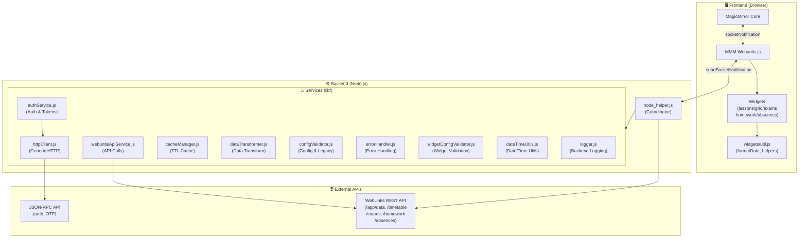

# MMM-Webuntis

> ⚠️ **Disclaimer / Haftungsausschluss**:
>
> **English:** This project is **not** an official Untis product, is **not** affiliated with, endorsed by, or supported by Untis GmbH or any of its subsidiaries. WebUntis is a registered trademark of Untis GmbH. This is an independent, community-developed module for MagicMirror² that interfaces with WebUntis APIs. Use at your own risk.
>
> **Deutsch:** Dieses Projekt ist **kein** offizielles Untis-Produkt und steht in **keiner** Verbindung zu Untis GmbH oder deren Tochtergesellschaften. Es wird **nicht** von Untis unterstützt oder empfohlen. WebUntis ist eine eingetragene Marke der Untis GmbH. Dies ist ein unabhängiges, von der Community entwickeltes Modul für MagicMirror², das die WebUntis-APIs nutzt. Nutzung auf eigene Gefahr.

> ⚠️ **Important Notice**:
>
> This project contains substantial AI-generated code. Review, test, and audit all files, web UI, and documentation before using it in production or safety-relevant contexts. Treat defaults and generated logic as untrusted until verified.

A MagicMirror² module that shows cancelled, irregular or substituted lessons from WebUntis for configured students. It fetches timetable, exams and homework data from WebUntis and presents them in a compact list or a multi-day grid.

## System Architecture



→ For a comprehensive overview of functions, data flow, initialization phases, and detailed diagrams, see [ARCHITECTURE.md](ARCHITECTURE.md).

## Architecture Highlights

**Modular Design**: The module follows a service-oriented architecture with 10 specialized modules in `lib/`:

- **httpClient.js** - Generic HTTP client for WebUntis (QR auth, credentials auth, bearer tokens) - **no direct WebUntis library dependency**
- **authService.js** - Authentication and token management with 14-minute caching
- **webuntisApiService.js** - Unified REST API client for all data fetching
- **dataTransformer.js** - Data normalization and transformation
- **cacheManager.js** - TTL-based caching for class IDs and other data
- **configValidator.js** - Schema validation and 25 legacy config mappings
- **widgetConfigValidator.js** - Widget-specific validation (grid, exams, homework, etc.)
- **errorHandler.js** - Centralized error handling and user-friendly messages
- **dateTimeUtils.js** - Date/time calculations and formatting
- **logger.js** - Configurable backend logging

**Benefits**:
- ✅ **Reduced coupling**: Generic HTTP client instead of tight WebUntis library dependency
- ✅ **Testability**: Each service is independently testable
- ✅ **Maintainability**: Clear separation of concerns (auth, data, validation, errors)
- ✅ **Performance**: Smart caching reduces API calls by ~70%
- ✅ **Code reduction**: node_helper.js reduced from 2,383 to ~1,550 lines (-35%)

## BREAKING CHANGES in 0.4.0

This release consolidates several configuration keys and changes how the module handles config compatibility.

Important notes:

- The module contains a compatibility mapper that automatically translates several deprecated keys from older configs to the new key names during startup. By design, when a deprecated key is present its value will now take precedence — legacy values "win" and overwrite the new key. This makes upgrades safer for users who still have old keys in place, but you should still update your `config.js` to the canonical names.

Mapper behavior and warnings:

- When deprecated keys are detected the frontend emits a conspicuous browser console warning (styled in red) that lists the detected legacy keys and their location (e.g. `students[0].days`). This helps you find and update old keys during MagicMirror startup.
- Additionally, the backend will log an informational message for fetch operations; however, the compatibility mapping and the red console warning are produced in the frontend module so you can see them in the browser devtools when MagicMirror starts.

Common legacy → new mappings (applied automatically if present):

- `fetchInterval` → `fetchIntervalMs`
- `days` → `daysToShow`
- `examsDays` → `examsDaysAhead`
- `mergeGapMin` → `mergeGapMinutes`
- legacy `debug` / `enableDebug` (boolean) → `logLevel: 'debug'` or `'none'`
- `displaymode` → `displayMode` (normalized to lowercase)

Quick tip: find deprecated keys in your `config.js` with this command (run from your MagicMirror folder):

```bash
grep -n "fetchInterval\|days\|mergeGapMin\|displaymode\|enableDebug\|debug" config/config.js || true
```

Upgrade notes:

1. The mapper will translate legacy keys automatically at startup, but it's recommended to update your `config.js` to the new key names listed above.
2. Use the red console warning and the quick grep above to find legacy keys and replace them.
3. Restart MagicMirror after editing `config.js` to ensure the new keys are used consistently.

## Installation

1. Go to your MagicMirror² `modules` folder and run:

```bash
git clone https://github.com/HeikoGr/MMM-Webuntis
cd MMM-Webuntis
npm ci --omit=dev
```

2. Add the module to your MagicMirror `config/config.js` (see example below).

## Update

To update to the latest version:

```bash
cd ~/MagicMirror/modules/MMM-Webuntis
git pull
npm ci --omit=dev
```

Restart MagicMirror after updating.

## Quick start

Add `MMM-Webuntis` to your `config/config.js` inside the `modules` array. Here's a **minimal** example:

```javascript
{
  module: "MMM-Webuntis",
  position: "top_right",
  config: {
    students: [
      { title: "Alice", qrcode: "untis://setschool?..." },
    ]
  }
},
```

For a more complete example with common options, see [config/config.template.js](config/config.template.js).

## Template-based config workflow

- This repository ships with templates in `config/` so you can bootstrap a MagicMirror setup quickly without committing personal credentials or styling tweaks.

- Copy the template files to `config.js` / `custom.css` inside the same folder (both paths are listed in `.gitignore`) and customize them locally:

```bash
cp config/config.template.js config/config.js
cp config/custom.template.css config/custom.css
```

If you are not using the DevContainer, you can still treat the template files as examples—copy them into your MagicMirror core folder manually and adjust them there.

## Configuration options

All configuration options are documented in [MMM-Webuntis.js](MMM-Webuntis.js#L1-L48) in the `defaults` object, organized by feature area. Global options can be declared at the top level of `config` and can be overridden per-student by adding the same property in a student object.

### Global Options

| Option | Type | Default | Description |
| --- | --- | --- | --- |
| `header` | string | `'MMM-Webuntis'` | Title displayed by MagicMirror for this module. |
| `fetchIntervalMs` | int | `15 * 60 * 1000` | Fetch interval in milliseconds (default 15 minutes). |
| `logLevel` | string | `'none'` | Log verbosity: `'debug'`, `'info'`, `'warn'`, `'error'`, or `'none'`. |

### Display Options

| Option | Type | Default | Description |
| --- | --- | --- | --- |
| `displayMode` | string | `'list'` | Comma-separated list of widgets to render (top-to-bottom). Supported: `grid`, `lessons`, `exams`, `homework`, `absences`, `messagesofday`. Backwards-compatible: `'list'` = `lessons, exams`; `'grid'` = `grid`. |
| `mode` | string | `'verbose'` | Display mode for lists: `'verbose'` (per-student sections) or `'compact'` (combined). |

### Timetable Fetch Range

| Option | Type | Default | Description |
| --- | --- | --- | --- |
| `nextDays` | int | `7` | Number of upcoming days to display **starting from tomorrow**. Example: `nextDays: 3` shows tomorrow, +2 days, +3 days. |
| `pastDays` | int | `0` | Number of past days to display **before today**. Example: `pastDays: 1` shows yesterday. |
| `debugDate` | string|null | `null` | Optional debug override for "today" in `YYYY-MM-DD` format. When set, the module will treat this date as the current day for all range calculations and rendering. |

**Range Calculation:** `totalDays = pastDays + 1 (today) + nextDays`
- Example: `pastDays: 1, nextDays: 3` = Yesterday + Today + Tomorrow + +2 days + +3 days = **5 days total**
- Default: `pastDays: 0, nextDays: 7` = Today + 7 future days = **8 days total**

Note: Legacy keys `daysToShow` and `pastDaysToShow` are still supported but deprecated — update your `config.js` to use `nextDays`/`pastDays`.

### Lessons Widget Options

Configure lessons widget behavior using the `lessons` configuration namespace:

| Option | Type | Default | Description |
| --- | --- | --- | --- |
| `lessons.dateFormat` | string | `'EEE'` | Date format for lessons. Supports tokens like `EEE` (short weekday), `EEEE` (long weekday), `dd`, `mm`, `yyyy`. Example: `'EEEE'` shows the full weekday name. |
| `lessons.showStartTime` | bool | `false` | Show start time instead of lesson number in listings. |
| `lessons.showRegular` | bool | `false` | Show regular lessons (not only substitutions/cancellations). |
| `lessons.useShortSubject` | bool | `false` | Use short subject names where available. |
| `lessons.showTeacherMode` | string | `'full'` | Teacher display mode: `'full'` (full name), `'initial'` (initials), or null/falsy for none. |
| `lessons.showSubstitution` | bool | `false` | Show substitution text/notes for changed lessons. |

**Example:**
```javascript
lessons: {
  dateFormat: 'EEEE',
  showStartTime: false,
  showTeacherMode: 'full',
}
```

### Grid Widget Options

Configure grid widget behavior using the `grid` configuration namespace:

| Option | Type | Default | Description |
| --- | --- | --- | --- |
| `grid.dateFormat` | string | `'EEE dd.MM.'` | Date format for grid header. Example: `'EEE dd.MM.'` shows weekday and date. |
| `grid.mergeGap` | int | `15` | Maximum gap (in minutes) between consecutive lessons to consider them mergeable. |
| `grid.maxLessons` | int | `0` | Limit lessons per day in grid view. `0` = show all; `>=1` limits to first N timeUnits. |
| `grid.showNowLine` | bool | `true` | Show the current time line in grid view. |
| `grid.nextDays` | int | - | (optional) Days ahead to display. **Range = `pastDays + 1 + nextDays`**. Example: `pastDays: 1, nextDays: 3` = 5 days. |
| `grid.pastDays` | int | - | (optional) Days past to display. If not set, uses global values. |

**Example (5-day view: yesterday + today + 3 days ahead):**
```javascript
grid: {
  dateFormat: 'EEE dd.MM.',
  mergeGap: 15,
  maxLessons: 8,
  showNowLine: true,
  nextDays: 3,  // 3 days ahead
  pastDays: 1,  // 1 day past
  // Total: 1 + 1 + 3 = 5 days
}
```

### Exams Widget Options

Configure exams widget behavior using the `exams` configuration namespace:

| Option | Type | Default | Description |
| --- | --- | --- | --- |
| `exams.dateFormat` | string | `'dd.MM.'` | Date format for exam dates. |
| `exams.daysAhead` | int | `21` | Number of days ahead to fetch exams (0 = off). |
| `exams.showSubject` | bool | `true` | Show subject for exams. |
| `exams.showTeacher` | bool | `true` | Show teacher for exams. |

**Example:**
```javascript
exams: {
  dateFormat: 'dd.MM.',
  daysAhead: 21,
  showSubject: true,
}
```

### Homework Widget Options

Configure homework widget behavior using the `homework` configuration namespace:

| Option | Type | Default | Description |
| --- | --- | --- | --- |
| `homework.dateFormat` | string | `'dd.MM.'` | Date format for homework due dates. |
| `homework.showSubject` | boolean | `true` | Show subject name with homework. Set to `false` to hide. |
| `homework.showText` | boolean | `true` | Show homework description/text. Set to `false` to display only subject and due date. |
| `homework.nextDays` | int | `28` | (optional) Widget-specific days ahead override. If not set, uses global `nextDays`. |
| `homework.pastDays` | int | `0` | (optional) Widget-specific days past override. If not set, uses global `pastDays`. |

**Example:**
```javascript
homework: {
  dateFormat: 'dd.MM.',
  showSubject: true,
  showText: true,
  nextDays: 45,
}
```

### Absences Widget Options

Configure absences widget behavior using the `absences` configuration namespace:

| Option | Type | Default | Description |
| --- | --- | --- | --- |
| `absences.dateFormat` | string | `'dd.MM.'` | Date format for absence dates. |
| `absences.pastDays` | int | `21` | Number of past days to include when fetching absences. |
| `absences.futureDays` | int | `7` | Number of future days to include when fetching absences. |
| `absences.showDate` | bool | `true` | Show absence date. |
| `absences.showExcused` | bool | `true` | Show excused/unexcused status indicator. |
| `absences.showReason` | bool | `true` | Show reason/note for absence. |
| `absences.maxItems` | int | `null` | (optional) Max absences to display (null = unlimited). |

**Example:**
```javascript
absences: {
  dateFormat: 'dd.MM.',
  pastDays: 21,
  futureDays: 7,
  showDate: true,
  showExcused: true,
  showReason: true,
  maxItems: 10,
}
```

### Timetable Source

| Option | Type | Default | Description |
| --- | --- | --- | --- |
| `useClassTimetable` | bool | `false` | Use class timetable instead of student timetable (some schools only provide class data). |

### Parent Account Support (Optional)

| Option | Type | Default | Description |
| --- | --- | --- | --- |
| `parentUsername` | string | - | Parent account email/username for accessing multiple children's data. |
| `parentPassword` | string | - | Parent account password. |
| `school` | string | - | School name (can be overridden per student). |
| `server` | string | `'webuntis.com'` | WebUntis server hostname. |

## Auto-Discovery Feature

The module includes an **automatic student discovery** feature that eliminates the need to manually configure each child's `studentId` when using parent account credentials.

### How it works

When you provide **parent account credentials** (`username`, `password`, `school`, `server`), the module will:

1. Authenticate with the parent account credentials
2. Fetch the list of children from WebUntis (`app/data` endpoint)
3. Automatically populate the `students` array with all children's names and IDs
4. Display all discovered children in the MagicMirror logs for reference

**Important:** Auto-discovery only happens when `students: []` is empty. If you manually configure ANY student, auto-discovery is skipped (respecting your explicit configuration).

### Example: Auto-Discovery Configuration

```javascript
{
  module: "MMM-Webuntis",
  position: "top_right",
  config: {
    // Parent account credentials
    username: "parent@example.com",
    password: "parentPassword123",
    school: "myschool",
    server: "myschool.webuntis.com",

    // Empty students array triggers auto-discovery
    students: [],

    // Rest of your config
    displayMode: "grid,exams,homeworks",
    daysToShow: 7,
  }
},
```

When MagicMirror starts, you'll see output like:

```
✓ Auto-discovered 2 student(s):
  • Emma Schmidt (ID: 12345)
  • Jonas Schmidt (ID: 12346)
```

### Customizing discovered students

If you want to customize settings for specific auto-discovered students using parent account mode, you can configure them with `studentId`. If you omit the `title`, the auto-discovered name will be used automatically:

```javascript
{
  module: "MMM-Webuntis",
  position: "top_right",
  config: {
    // Parent account credentials
    username: "parent@example.com",
    password: "parentPassword123",
    school: "myschool",
    server: "myschool.webuntis.com",

    // Configure only the students you want to customize
    students: [
      {
        studentId: 12345,             // Must match the auto-discovered ID
        // title omitted - will use auto-discovered name "Emma Schmidt"
        daysToShow: 5,                // Custom settings per student
      },
      {
        studentId: 12346,
        title: "Jonas (custom)",       // Override auto-discovered name
        daysToShow: 7,
      },
    ],

    displayMode: "grid,exams,homeworks",
  }
},
```

**Result:**
- Emma (ID 12345) will display with auto-discovered name but `daysToShow: 5`
- Jonas (ID 12346) will display as "Jonas (custom)" with `daysToShow: 7`
- Only the configured students are shown (no additional auto-discovery)

### How to get the `studentId` from logs

If you need to manually add a `studentId` to your configuration, follow these steps:

#### Step 1: Enable Auto-Discovery Temporarily

Create a config with empty `students` array and parent credentials:

```javascript
{
  module: "MMM-Webuntis",
  config: {
    username: "parent@example.com",
    password: "parentPassword123",
    school: "myschool",
    server: "myschool.webuntis.com",
    students: [],  // Empty = trigger auto-discovery
  }
},
```

#### Step 2: Check the MagicMirror Logs

Start MagicMirror and look at the **console logs or server terminal output**. You'll see:

```
✓ Auto-discovered 2 student(s):
  • Emma Schmidt (ID: 12345)
  • Jonas Schmidt (ID: 12346)
```

**The ID in parentheses is the `studentId` you need.**

#### Step 3: Copy the IDs to Your Config

Now update your config with the student IDs and custom names:

```javascript
{
  module: "MMM-Webuntis",
  config: {
    username: "parent@example.com",
    password: "parentPassword123",
    school: "myschool",
    server: "myschool.webuntis.com",

    students: [
      {
        title: "Emma",
        studentId: 12345,  // From the auto-discovery log
      },
      {
        title: "Jonas",
        studentId: 12346,  // From the auto-discovery log
      },
    ],

    displayMode: "grid,exams,homeworks",
  }
},
```

#### Troubleshooting: No logs visible?

If you don't see the auto-discovery message:

1. **Verify parent credentials** — Make sure `username`, `password`, `school`, and `server` are correct
2. **Check logLevel** — Set `logLevel: 'debug'` temporarily to see more details:
   ```javascript
   config: {
     username: "parent@example.com",
     password: "parentPassword123",
     school: "myschool",
     server: "myschool.webuntis.com",
     students: [],
     logLevel: 'debug',  // Enable debug output
   }
   ```
3. **Check MagicMirror logs** — Look at the terminal where you started MagicMirror (not just the browser console)

### Debug / Development Options

| Option | Type | Default | Description |
| --- | --- | --- | --- |
| `dumpBackendPayloads` | bool | `false` | Dump backend API responses to `debug_dumps/` folder for troubleshooting. |

### Student Credential Object

Each entry in the `students` array is an object with the following fields:

#### Required

- `title` (string) — displayed name for the student in the module output.

#### Credentials (choose one)

**Option A: QR Code (Recommended)**
- `qrcode` (string) — WebUntis QR code string (`untis://setschool?url=...&school=...&user=...&key=...`).
  - To get the QR code: log into WebUntis → Account → Data Access → generate QR code for this app.

**Option B: Direct Credentials**
- `username` (string) — student's WebUntis username or email.
- `password` (string) — student's WebUntis password.
- `school` (string) — school name in WebUntis.
- `server` (string, optional) — WebUntis server hostname (defaults to `webuntis.com`).

#### Optional Fields

- `class` (string) — class name (only needed if `useClassTimetable: true` and you want to fetch class timetable data).
- `studentId` (number) — when using parent account mode (see [Parent Account Support](README.md#parent-account-support-optional)), use this to configure children by their ID instead of individual credentials.
- Per-student option overrides — any global option (like `daysToShow`, `exams.daysAhead`, `logLevel`, etc.) can be supplied here to override the global value for this student only.

#### Example with QR Code

```javascript
{
  title: "Alice",
  qrcode: "untis://setschool?url=https://example.webuntis.com&school=example&user=alice&key=ABC123XYZ",
  daysToShow: 5, // override global daysToShow for this student
}
```

#### Example with Direct Credentials

```javascript
{
  title: "Bob",
  username: "bob.smith@school.edu",
  password: "password123",
  school: "Example School",
  server: "example.webuntis.com",
}
```

#### Example with Parent Account (studentId)

When using parent account credentials (see [Parent Account Support](README.md#parent-account-support-optional)), you can also configure children by `studentId`:

```javascript
{
  title: "Child 1",
  studentId: 12345, // retrieved from parent account API
}
```

## How the timetable grid works (developer notes)

- The backend (`node_helper.js`) fetches raw WebUntis data from the REST API. The frontend builds `timeUnits` from the timegrid and computes minute values from `startTime`/`endTime` strings when rendering.
- The frontend merges consecutive lessons with identical subject/teacher/code when the gap is within `mergeGap` (minutes). A merged block keeps a `lessonIds` array; `lessonId` is set when available.
- The backend includes a response cache (30s TTL) and REST auth token cache (14min TTL) to minimize redundant API calls and avoid authentication overhead.

Additional grid rendering notes:

- When `maxLessons` is set to `>=1` and `timeUnits` are available, the grid vertical range (time axis, hour lines and lesson blocks) is clipped to the end/start of the Nth `timeUnit` so periods below the cutoff are not shown. A small "... more" badge appears in the day's column when additional lessons are hidden.

## Debugging and Logging

- The default `logLevel` is `'none'` (silent). Set it to `'debug'` to enable detailed logging.
- Enable `dumpBackendPayloads: true` to save backend API responses to the `debug_dumps/` folder for detailed inspection and troubleshooting.

## Troubleshooting

- **Empty results:** Check credentials and try `useClassTimetable: true` — some schools expose only class timetables.
- **Debug info:** Enable `logLevel: 'debug'` in the config and check the MagicMirror server log.
- **SSO/MS365 logins:** If a student uses corporate SSO, generate a WebUntis data-access QR code inside the student's account and use that instead of direct credentials.
- **Absences with parent accounts:** The WebUntis API does not support retrieving absences through parent account logins. Absences are only available when logged in directly as the student. If `displayMode` includes `absences` but uses parent account credentials, the module will silently skip absences.

## CLI tool (config check)

This module includes an interactive CLI tool that reads your MagicMirror config, lists configured students, and lets you query a selected student's timetable, exams, homework, and absences.

Run from the module directory:

```bash
node cli/cli.js
```

If your config is not in a standard location, pass it explicitly:

```bash
node cli/cli.js --config /path/to/config.js
```

## Dependencies

- [TheNoim/WebUntis](https://github.com/TheNoim/WebUntis) — installed via `npm install` in the module directory.

## Holiday Display

The `lessons` and `grid` widgets automatically display holiday information from the WebUntis API:

- **Lessons widget:** Shows a holiday notice with the 🏖️ emoji and holiday name on days that fall within a holiday period (no lessons shown)
- **Grid widget:** Displays a semi-transparent overlay with the 🏖️ emoji and holiday name on holiday days
- **Warning suppression:** The "No lessons found" warning is automatically suppressed during holiday periods

### How it works

The backend pre-computes a `holidayByDate` lookup map for the requested date range and includes it in the payload. Widgets simply look up each date in this map instead of iterating through holiday periods. This centralizes holiday detection in the backend and simplifies widget code.

The payload also includes a `currentHoliday` field (the active holiday for today, or `null`) which is used to suppress the "No lessons found" warning during vacation periods.

No additional configuration is required — holiday data is automatically fetched from WebUntis alongside timetable data.

## Troubleshooting & Migration Guide

### Deprecated Configuration Keys

The module automatically maps 25 legacy configuration keys to their new equivalents. When deprecated keys are detected, you'll see:
- **Red browser console warning** listing all deprecated keys and their locations
- **Backend logs** with detailed migration instructions

**Common migrations**:
- `fetchInterval` → `fetchIntervalMs` (e.g., `300000` instead of `300`)
- `days` → `nextDays` (for student-level config)
- `examsDays` / `exams.daysAhead` → `exams.nextDays`
- `mergeGapMin` → `grid.mergeGap`
- `debug: true` / `enableDebug: true` → `logLevel: 'debug'`
- `displaymode` → `displayMode` (normalized to lowercase)

**Find deprecated keys in your config**:
```bash
cd ~/MagicMirror
grep -n "fetchInterval\\|examsDays\\|mergeGapMin\\|displaymode\\|enableDebug\\|\\\"debug\\\":" config/config.js
```

### Authentication Issues

**QR Code Login Fails**:
1. Ensure QR code URL is complete: `untis://setschool?...&key=...&url=...&school=...`
2. Check server logs: `pm2 logs MagicMirror --lines 50 | grep -i "qr\\|auth"`
3. Verify OTP generation: The module uses `otplib` to generate time-based tokens

**Parent Account Login Fails**:
1. Verify credentials in module config: `username`, `password`, `school`, `server`
2. Check student `studentId` matches WebUntis (visible in app/data response)
3. Backend logs will show: `"Creating WebUntis client for parent account"`

**Token Expiration**:
- Bearer tokens expire after 15 minutes (cached for 14 minutes with 1-minute buffer)
- If you see frequent re-authentication, check system clock synchronization
- Monitor cache stats in debug logs: `[AuthService] REST auth token obtained successfully`

### Data Not Loading

**Empty Widgets**:
1. Check date range: `nextDays` and `pastDays` must cover the period you want to see
2. Verify `studentId` in logs: `"Processing student: <title> (ID: <studentId>)"`
3. Check for warnings in GOT_DATA payload (browser console)

**Specific Widget Issues**:
- **Exams**: Set `exams.nextDays` (default: 21 days, range: 0-365)
- **Homework**: Set `homework.nextDays` (default: 28 days)
- **Absences**: Set `absences.pastDays` (default: 21 days, range: 0-90)
- **Grid**: Verify `grid.nextDays` and `grid.pastDays`

### Performance Optimization

**Reduce API Calls**:
- Increase `fetchIntervalMs` (default: 5 minutes = 300000ms)
- Use smaller date ranges (`nextDays`, `pastDays`)
- Enable caching is automatic (14-minute TTL for auth, class IDs cached indefinitely)

**Debug Logging**:
```javascript
logLevel: 'debug'  // Shows all HTTP requests, cache hits, authentication flow
```

Check logs: `pm2 logs MagicMirror --lines 200 | grep -E "\\[MMM-Webuntis\\]|\\[HttpClient\\]|\\[AuthService\\]"`

### Migration from 0.3.x to 0.4.x

**No breaking changes** for most users, but recommended updates:

1. **Update deprecated keys** (see section above)
2. **Verify exam configuration**: Change `exams.daysAhead` to `exams.nextDays`
3. **Test authentication**: QR code and parent account flows have been refactored
4. **Review logs**: New modular architecture provides more detailed logging

**Rollback** (if needed):
```bash
cd ~/MagicMirror/modules/MMM-Webuntis
git checkout v0.3.x  # Replace with your previous version tag
npm ci --omit=dev
pm2 restart MagicMirror
```

## Screenshot

displayMode: "list", mode: "verbose":


displayMode: "messagesofday,grid,exams,homework,absences":

')

## Attribution

This project is based on work done by Paul-Vincent Roll in the MMM-Wunderlist module. (<https://github.com/paviro/MMM-Wunderlist>)
