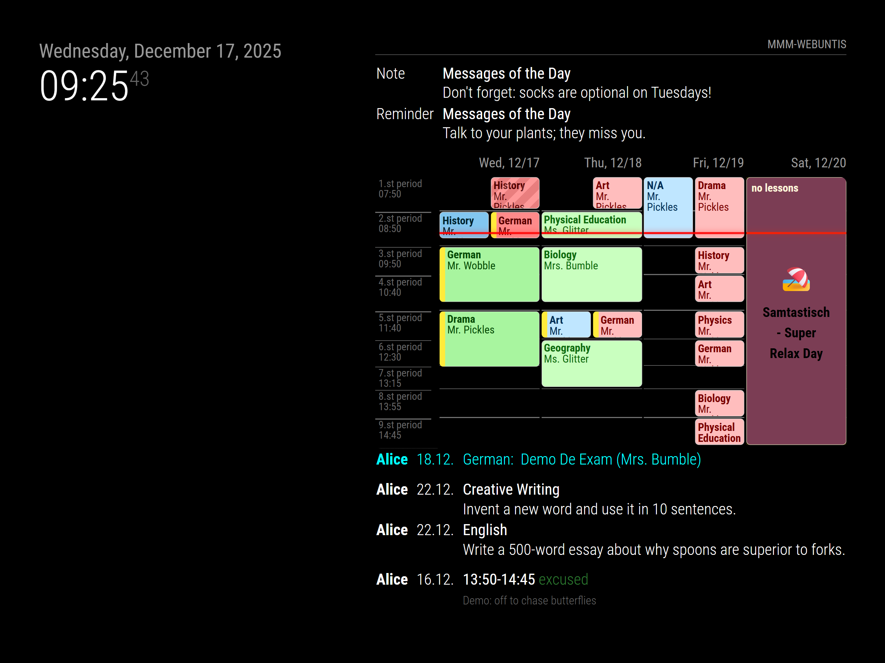
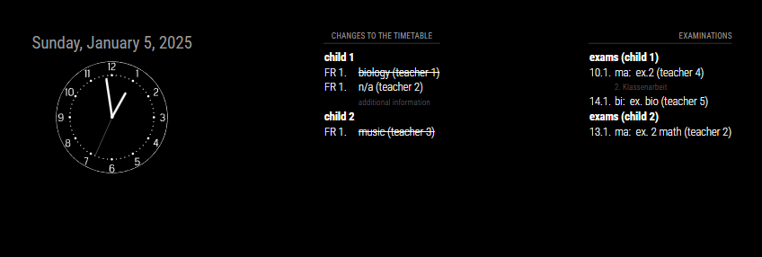

# MMM-Webuntis

> ⚠️ **Disclaimer / Haftungsausschluss**:
>
> **English:** This project is **not** an official Untis product and is not affiliated with, endorsed by, or supported by Untis GmbH or any of its subsidiaries. WebUntis is a registered trademark of Untis GmbH. The software is provided without warranty, including accuracy, completeness, or error-free operation of displayed WebUntis data. Use is at your own risk.
>
> **Deutsch:** Dieses Projekt ist **kein** offizielles Untis-Produkt und steht in **keiner** Verbindung zu Untis GmbH oder deren Tochtergesellschaften; es wird nicht von Untis unterstützt oder empfohlen. WebUntis ist eine eingetragene Marke der Untis GmbH. Die Software wird ohne Gewähr bereitgestellt; insbesondere wird keine Haftung für Fehlerfreiheit sowie für Vollständigkeit, Aktualität oder Richtigkeit der angezeigten WebUntis-Daten übernommen. Die Nutzung erfolgt auf eigene Gefahr.

> ⚠️ **Important Notice**:
>
> This project contains substantial AI-generated code. Review, test, and audit all files, web UI, and documentation before using it in production or safety-relevant contexts. Treat defaults and generated logic as untrusted until verified.

A MagicMirror² module that displays WebUntis timetables, exams, homework, absences, and messages of day.

## Requirements

- Node.js `>=20.18.1`

Older Node 20 installations have shown authentication and runtime failures in real-world setups, especially around the module's native HTTP stack. If direct login or QR login suddenly stops working, update Node first and then run `npm ci --omit=dev` again.

## Installation

```bash
cd ~/MagicMirror/modules
git clone https://github.com/HeikoGr/MMM-Webuntis
cd MMM-Webuntis
npm ci --omit=dev
```

## Update

```bash
cd ~/MagicMirror/modules/MMM-Webuntis
node -v
git pull
npm ci --omit=dev
```

If `git pull` fails because your local history diverged, either re-clone the module or reset it to the remote state after backing up local changes:

```bash
cd ~/MagicMirror/modules/MMM-Webuntis
git fetch origin
git reset --hard origin/master
npm ci --omit=dev
```

## Quick Start

Use [docs/CONFIG.md](docs/CONFIG.md) as the configuration source of truth. A minimal QR-code setup looks like this:

```javascript
{
  module: 'MMM-Webuntis',
  position: 'top_right',
  config: {
    displayMode: 'grid, lessons, exams',
    students: [
      {
        title: 'Alice',
        qrcode: 'untis://setschool?url=myschool.webuntis.com&school=myschool&user=alice&key=ABC123...',
      },
    ],
  },
}
```

## Authentication

MMM-Webuntis supports two canonical auth modes:

- QR code login for students, parents, and SSO-backed accounts
- Username/password login for regular non-SSO accounts

Parent accounts can be configured at module level with `students: []` to enable child auto-discovery. Mixed per-student credentials are supported, but the full matrix of valid config shapes is documented only in [docs/CONFIG.md](docs/CONFIG.md#authentication-patterns).

## Common Setups

Typical patterns:

- Week view: `displayMode: 'grid'` with `grid.weekView: true`
- Parent account auto-discovery: top-level credentials plus `students: []`
- Multiple families: use multiple module instances
- Class timetable mode: set `useClassTimetable: true` globally or per student

## Widgets

Set `displayMode` to a comma-separated list:

- `grid`
- `lessons`
- `exams`
- `homework`
- `absences`
- `messagesofday`

`list` remains a supported alias for `lessons, exams`.

## Styling

The module uses a semantic color system:

- Blue for active and informational states
- Yellow for changed and warning states
- Red for cancelled and critical states

For styling, CSS variables, accessibility guidance, and the legacy multi-color recreation, use [docs/CSS_CUSTOMIZATION.md](docs/CSS_CUSTOMIZATION.md#legacy-color-theme-exact-values).

## Troubleshooting

If data is missing or empty:

1. Verify the auth method and credentials.
2. Set `logLevel: 'debug'`.
3. Check recent backend logs with `pm2 logs --lines 100`.
4. For parent setups, confirm that `students: []` is used for auto-discovery.
5. For SSO accounts, use QR code instead of direct credentials.

## CLI And Checks

Useful scripts:

- `node --run debug`
- `node --run check`
- `node --run lint`
- `node --run test:spelling`
- `node --run test:auth:curl`

Use the low-level curl auth test when you want to bypass module logic entirely:

```bash
node --run test:auth:curl
./scripts/test_auth_with_curl.sh "school" "server.webuntis.com" "username" "password"
```

## Documentation

Start with [docs/README.md](docs/README.md).

- [docs/CONFIG.md](docs/CONFIG.md) - canonical configuration reference
- [docs/API_V2_MANIFEST.md](docs/API_V2_MANIFEST.md) - backend/frontend payload contract
- [docs/API_REFERENCE.md](docs/API_REFERENCE.md) - external WebUntis endpoints and normalization
- [docs/SERVER_REQUEST_FLOW.md](docs/SERVER_REQUEST_FLOW.md) - runtime fetch, retry, and status behavior
- [docs/ARCHITECTURE.md](docs/ARCHITECTURE.md) - high-level module structure and responsibilities
- [docs/CSS_CUSTOMIZATION.md](docs/CSS_CUSTOMIZATION.md) - styling, accessibility, and legacy theme overrides
- [docs/CLI.md](docs/CLI.md) - CLI usage
- [config/config.template.js](config/config.template.js) - example configuration

## Screenshots

**Week view (grid):**



**List view (lessons + exams):**



## Support

- Issues: [GitHub Issues](https://github.com/HeikoGr/MMM-Webuntis/issues)
- Documentation: start with [docs/README.md](docs/README.md)
- Logs: enable `logLevel: 'debug'` in your config

## License

MIT License - See [LICENSE](LICENSE)

---

**Note:** This module contains AI-generated code. Review and test thoroughly before production use.