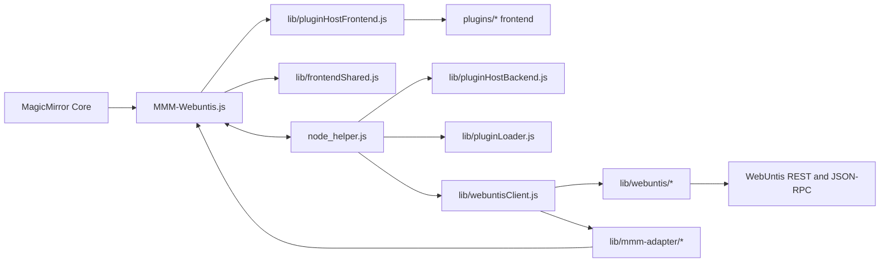

# MMM-Webuntis Architecture

This document describes the stable module structure and responsibility boundaries. It intentionally avoids volatile details such as line numbers, temporary performance measurements, or refactoring history.

## Purpose

Use this document for:
- understanding which layer owns which responsibility
- finding the right file family before making changes
- seeing how frontend, adapter, and WebUntis core fit together

For runtime request behavior, see [SERVER_REQUEST_FLOW.md](SERVER_REQUEST_FLOW.md).
For the current payload contract, see [API_V3_MANIFEST.md](API_V3_MANIFEST.md).
For the plugin runtime contract, manifest model, and host APIs, see [PLUGINS.md](PLUGINS.md).

## System Boundaries

```mermaid
flowchart LR
    MM[MagicMirror Core]
    FE[MMM-Webuntis.js]
    PH[lib/pluginHostFrontend.js]
    P[plugins/* frontend]
    FS[lib/frontendShared.js]
    NH[node_helper.js]
    PB[lib/pluginHostBackend.js]
    PL[lib/pluginLoader.js]
    FACADE[lib/webuntisClient.js]
    CORE[lib/webuntis/*]
    BUILD[lib/mmm-adapter/*]
    API[WebUntis REST and JSON-RPC]

    MM --> FE
    FE --> PH
    FE --> FS
    PH --> P
    FE <--> NH
    NH --> PL
    NH --> PB
    NH --> FACADE
    FACADE --> CORE
    FACADE --> BUILD
    CORE --> API
    BUILD --> FE
```

## Layer Responsibilities

### Frontend

Files:
- `MMM-Webuntis.js`
- `lib/pluginHostFrontend.js`
- `lib/frontendShared.js`
- `plugins/*/frontend.js`
- `MMM-Webuntis.css`

Responsibilities:
- send `CONFIGURE` and `REFRESH`
- receive `MODULE_READY`, `MODULE_INIT_FAILED`, and `DATA_UPDATE`
- load frontend plugin assets and register plugin instances
- render active plugins through the frontend plugin host
- format already-normalized data for display

The frontend should not know WebUntis endpoint details.

### MagicMirror Adapter Layer

Files:
- `node_helper.js`
- `lib/pluginLoader.js`
- `lib/pluginHostBackend.js`
- `lib/pluginCapabilityResolver.js`
- `lib/webuntisClient.js`
- `lib/configValidator.js`
- `lib/widgetConfigValidator.js`
- `lib/logger.js`

Responsibilities:
- validate and normalize module config
- discover plugin manifests and backend entrypoints
- normalize legacy `displayMode` and namespaced widget config into canonical `plugins.<id>` config
- manage session identifiers and lifecycle
- derive fetch capabilities from active plugins
- coordinate fetches per configured module instance
- compose WebUntis core results with the MMM payload adapter
- convert backend results into MagicMirror socket notifications

This layer owns the MagicMirror-facing behavior, not the raw WebUntis API logic.

### WebUntis Core

Files:
- `lib/webuntis/authService.js`
- `lib/webuntis/webuntisClient.js`
- `lib/webuntis/webuntisApiService.js`
- `lib/webuntis/dataFetchOrchestrator.js`
- `lib/webuntis/restClient.js`
- `lib/webuntis/httpClient.js`
- `lib/webuntis/fetchClient.js`
- `lib/webuntis/cacheManager.js`

Responsibilities:
- authenticate against JSON-RPC and bootstrap REST access
- maintain token and session caches
- decide which WebUntis targets to query
- execute timetable-first fetching and endpoint retries
- isolate transport concerns from business logic
- stop at normalized bundle data and stay unaware of the MagicMirror payload contract

This layer is the source of truth for external WebUntis interactions.

### Data Shaping And Contract Build

Files:
- `lib/webuntis/dataOrchestration.js`
- `lib/webuntis/errorHandler.js`
- `lib/webuntis/errorUtils.js`
- `lib/mmm-adapter/mmmPayloadMapper.js`

Responsibilities:
- normalize dates, times, and field shapes
- sanitize HTML-bearing fields
- compact payloads before they reach the frontend
- map fetched data into the canonical `DATA_UPDATE` contract
- keep MMM contract-building logic co-located in one adapter module

This layer separates transport data from frontend-facing runtime data.

## Main Control Flow

1. `MMM-Webuntis.js` sends `CONFIGURE`.
2. `node_helper.js` validates config and prepares session state.
3. `node_helper.js` triggers the first fetch automatically.
4. `webuntisClient` and `dataFetchOrchestrator` run the fetch flow.
5. `lib/webuntisClient.js` maps the normalized bundle into the `DATA_UPDATE` payload.
6. `node_helper.js` emits `DATA_UPDATE`.
7. Frontend plugin renderers consume the normalized result.

Current compatibility note:

- `displayMode` remains a valid public config option.
- The backend normalizes `displayMode` and top-level legacy plugin namespaces into canonical `plugins.<id>.enabled` and `plugins.<id>.config`.
- The frontend render path is plugin-only.

## Key Architectural Rules

### Configuration Rules

- Canonical config names are defined by the validators and documented in the project wiki's [Configuration](https://github.com/HeikoGr/MMM-Webuntis/wiki/Configuration) page.
- Legacy config keys may still be mapped internally, but they are not the public documentation target.

### API Rules

- Authentication happens through `authService` and `httpClient`, not ad-hoc network calls.
- REST endpoint calls go through `webuntisApiService` and `restClient`.
- Runtime retry and skip behavior belongs to the request-flow layer, not the frontend.

### Contract Rules

- The frontend relies on the normalized runtime contract documented in [API_V3_MANIFEST.md](API_V3_MANIFEST.md).
- `lib/webuntis/webuntisClient.js` must not import `lib/mmm-adapter/*`; payload mapping belongs to the public adapter facade.
- Debug dumps can be richer than the runtime payload and are not a public contract.

### Styling Rules

- Styling is driven by CSS variables and widget hooks documented in [CSS_CUSTOMIZATION.md](CSS_CUSTOMIZATION.md).
- Rendering-specific grid behavior is documented separately in [GRID_RENDERING_LOGIC.md](GRID_RENDERING_LOGIC.md).

## Where To Start When Changing Something

| Change type | Start here |
| --- | --- |
| Config key or auth shape | The wiki [Configuration](https://github.com/HeikoGr/MMM-Webuntis/wiki/Configuration) and [Authentication](https://github.com/HeikoGr/MMM-Webuntis/wiki/Authentication) pages plus the validators |
| Endpoint or auth bug | [SERVER_REQUEST_FLOW.md](SERVER_REQUEST_FLOW.md) and `lib/webuntis/*` |
| Payload field or frontend/backend contract | [API_V3_MANIFEST.md](API_V3_MANIFEST.md) |
| Widget rendering issue | `plugins/*` plus [GRID_RENDERING_LOGIC.md](GRID_RENDERING_LOGIC.md) for grid-specific logic |
| Styling or accessibility | [CSS_CUSTOMIZATION.md](CSS_CUSTOMIZATION.md) |

## Related Docs

- User-facing setup: [Wiki Home](https://github.com/HeikoGr/MMM-Webuntis/wiki)
- [API_REFERENCE.md](API_REFERENCE.md)
- [SERVER_REQUEST_FLOW.md](SERVER_REQUEST_FLOW.md)
- [API_V3_MANIFEST.md](API_V3_MANIFEST.md)
- [PLUGINS.md](PLUGINS.md)
- [CSS_CUSTOMIZATION.md](CSS_CUSTOMIZATION.md)
- [GRID_RENDERING_LOGIC.md](GRID_RENDERING_LOGIC.md)