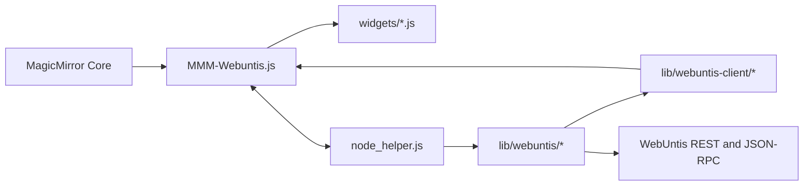

# MMM-Webuntis Architecture

This document describes the stable module structure and responsibility boundaries. It intentionally avoids volatile details such as line numbers, temporary performance measurements, or refactoring history.

## Purpose

Use this document for:
- understanding which layer owns which responsibility
- finding the right file family before making changes
- seeing how frontend, adapter, and WebUntis core fit together

For runtime request behavior, see [SERVER_REQUEST_FLOW.md](SERVER_REQUEST_FLOW.md). For the payload contract, see [API_V2_MANIFEST.md](API_V2_MANIFEST.md).

## System Boundaries

```mermaid
flowchart LR
    MM[MagicMirror Core]
    FE[MMM-Webuntis.js]
    W[widgets/*.js]
    NH[node_helper.js]
    CORE[lib/webuntis/*]
    BUILD[lib/webuntis-client/*]
    API[WebUntis REST and JSON-RPC]

    MM --> FE
    FE --> W
    FE <--> NH
    NH --> CORE
    CORE --> BUILD
    CORE --> API
    BUILD --> FE
```

## Layer Responsibilities

### Frontend

Files:
- `MMM-Webuntis.js`
- `widgets/*.js`
- `widgets/util.js`
- `MMM-Webuntis.css`

Responsibilities:
- send `INIT_MODULE` and `FETCH_DATA`
- receive `MODULE_INITIALIZED`, `INIT_ERROR`, and `GOT_DATA`
- render the configured widgets
- format already-normalized data for display

The frontend should not know WebUntis endpoint details.

### MagicMirror Adapter Layer

Files:
- `node_helper.js`
- `lib/configValidator.js`
- `lib/widgetConfigValidator.js`
- `lib/logger.js`

Responsibilities:
- validate and normalize module config
- manage session identifiers and lifecycle
- coordinate fetches per configured module instance
- convert backend results into MagicMirror socket notifications

This layer owns the MagicMirror-facing behavior, not the raw WebUntis API logic.

### WebUntis Core

Files:
- `lib/webuntis/authService.js`
- `lib/webuntis/webuntisClient.js`
- `lib/webuntis/webuntisApiService.js`
- `lib/webuntis/dataFetchOrchestrator.js`
- `lib/webuntis/restClient.js`
- `lib/webuntis/httpClient.js`
- `lib/webuntis/fetchClient.js`
- `lib/webuntis/cacheManager.js`

Responsibilities:
- authenticate against JSON-RPC and bootstrap REST access
- maintain token and session caches
- decide which WebUntis targets to query
- execute timetable-first fetching and endpoint retries
- isolate transport concerns from business logic

This layer is the source of truth for external WebUntis interactions.

### Data Shaping And Contract Build

Files:
- `lib/webuntis/dataOrchestration.js`
- `lib/webuntis/payloadCompactor.js`
- `lib/webuntis/errorHandler.js`
- `lib/webuntis/errorUtils.js`
- `lib/webuntis-client/payloadBuilder.js`
- `lib/webuntis-client/mmmPayloadMapper.js`

Responsibilities:
- normalize dates, times, and field shapes
- sanitize HTML-bearing fields
- compact payloads before they reach the frontend
- map fetched data into the canonical `GOT_DATA` contract

This layer separates transport data from frontend-facing runtime data.

## Main Control Flow

1. `MMM-Webuntis.js` sends `INIT_MODULE`.
2. `node_helper.js` validates config and prepares session state.
3. `node_helper.js` triggers the first fetch automatically.
4. `webuntisClient` and `dataFetchOrchestrator` run the fetch flow.
5. `payloadBuilder` assembles the contract payload.
6. `node_helper.js` emits `GOT_DATA`.
7. Frontend widgets render the normalized result.

## Key Architectural Rules

### Configuration Rules

- Canonical config names are defined by the validators and documented in [CONFIG.md](CONFIG.md).
- Legacy config keys may still be mapped internally, but they are not the public documentation target.

### API Rules

- Authentication happens through `authService` and `httpClient`, not ad-hoc network calls.
- REST endpoint calls go through `webuntisApiService` and `restClient`.
- Runtime retry and skip behavior belongs to the request-flow layer, not the frontend.

### Contract Rules

- The frontend relies on the normalized runtime contract documented in [API_V2_MANIFEST.md](API_V2_MANIFEST.md).
- Debug dumps can be richer than the runtime payload and are not a public contract.

### Styling Rules

- Styling is driven by CSS variables and widget hooks documented in [CSS_CUSTOMIZATION.md](CSS_CUSTOMIZATION.md).
- Rendering-specific grid behavior is documented separately in [GRID_RENDERING_LOGIC.md](GRID_RENDERING_LOGIC.md).

## Where To Start When Changing Something

| Change type | Start here |
| --- | --- |
| Config key or auth shape | [CONFIG.md](CONFIG.md) and the validators |
| Endpoint or auth bug | [SERVER_REQUEST_FLOW.md](SERVER_REQUEST_FLOW.md) and `lib/webuntis/*` |
| Payload field or frontend/backend contract | [API_V2_MANIFEST.md](API_V2_MANIFEST.md) |
| Widget rendering issue | `widgets/*.js` and [GRID_RENDERING_LOGIC.md](GRID_RENDERING_LOGIC.md) for grid-specific logic |
| Styling or accessibility | [CSS_CUSTOMIZATION.md](CSS_CUSTOMIZATION.md) |

## Related Docs

- [CONFIG.md](CONFIG.md)
- [API_REFERENCE.md](API_REFERENCE.md)
- [SERVER_REQUEST_FLOW.md](SERVER_REQUEST_FLOW.md)
- [API_V2_MANIFEST.md](API_V2_MANIFEST.md)
- [CSS_CUSTOMIZATION.md](CSS_CUSTOMIZATION.md)
- [GRID_RENDERING_LOGIC.md](GRID_RENDERING_LOGIC.md)