# MMM-Webuntis Architecture & Data Flow

**Last Updated**: 2026-01-13
**Project Status**: Production-ready with identified refactoring opportunities

## Executive Summary

MMM-Webuntis is a sophisticated MagicMirror² module featuring a **service-oriented architecture** with 14 specialized backend services and 6 configurable widget renderers. The module successfully migrated from legacy JSON-RPC API to modern REST API while maintaining backward compatibility through 25 legacy config mappings. Key strengths include robust authentication (QR code, credentials, parent accounts), comprehensive error handling, and extensive documentation.

**Code Metrics**:
- Total LOC: ~5,200
- Backend Services: 14 modules (lib/)
- Frontend Widgets: 6 renderers
- Test Coverage: 0% (planned improvement)
- ESLint Errors: 0
- Documentation: 27 markdown files

## System Overview


## Modular Architecture (lib/)

The module uses a **service-oriented architecture** with specialized modules in the `lib/` directory:

### Core Services

**[httpClient.js](https://github.com/HeikoGr/MMM-Webuntis/blob/master/lib/httpClient.js)** - JSON-RPC client for WebUntis authentication
- [`class HttpClient`](https://github.com/HeikoGr/MMM-Webuntis/blob/master/lib/httpClient.js#L28) - Main class
- [`authenticateWithCredentials()`](https://github.com/HeikoGr/MMM-Webuntis/blob/master/lib/httpClient.js#L89) - Username/password auth
- [`authenticateWithQRCode()`](https://github.com/HeikoGr/MMM-Webuntis/blob/master/lib/httpClient.js#L183) - QR code + OTP auth
- [`getBearerToken()`](https://github.com/HeikoGr/MMM-Webuntis/blob/master/lib/httpClient.js#L244) - Fetch JWT bearer token
- Session cookie management via [cookieJar.js](https://github.com/HeikoGr/MMM-Webuntis/blob/master/lib/cookieJar.js)
- **Dependencies**: cookieJar.js

**[authService.js](https://github.com/HeikoGr/MMM-Webuntis/blob/master/lib/authService.js)** - Authentication and token caching
- [`class AuthService`](https://github.com/HeikoGr/MMM-Webuntis/blob/master/lib/authService.js#L29) - Main service class
- [`getAuth()`](https://github.com/HeikoGr/MMM-Webuntis/blob/master/lib/authService.js#L121) - Main auth entry point (with caching)
- Token caching: 14-minute TTL, 1-minute safety buffer
- QR code auth flow, parent account support
- School/server resolution from QR codes
- **Dependencies**: httpClient.js, fetchClient.js, cacheManager.js

**[webuntisApiService.js](https://github.com/HeikoGr/MMM-Webuntis/blob/master/lib/webuntisApiService.js)** - Unified REST API client
- [`callWebUntisAPI()`](https://github.com/HeikoGr/MMM-Webuntis/blob/master/lib/webuntisApiService.js#L85) - Generic API caller
- [`getTimetable()`](https://github.com/HeikoGr/MMM-Webuntis/blob/master/lib/webuntisApiService.js#L164) - Fetch timetable data
- [`getExams()`](https://github.com/HeikoGr/MMM-Webuntis/blob/master/lib/webuntisApiService.js#L199) - Fetch exams
- [`getHomework()`](https://github.com/HeikoGr/MMM-Webuntis/blob/master/lib/webuntisApiService.js#L234) - Fetch homework
- [`getAbsences()`](https://github.com/HeikoGr/MMM-Webuntis/blob/master/lib/webuntisApiService.js#L269) - Fetch absences
- [`getMessagesOfDay()`](https://github.com/HeikoGr/MMM-Webuntis/blob/master/lib/webuntisApiService.js#L304) - Fetch messages
- **Dependencies**: restClient.js, authService.js, dataTransformer.js

**[restClient.js](https://github.com/HeikoGr/MMM-Webuntis/blob/master/lib/restClient.js)** - REST API wrapper
- [`callRestEndpoint()`](https://github.com/HeikoGr/MMM-Webuntis/blob/master/lib/restClient.js#L27) - Generic REST caller
- Bearer token authentication
- Tenant ID header management (`X-Webuntis-Api-Tenant-Id`)
- Response parsing and error handling
- **Dependencies**: fetchClient.js, errorHandler.js, logger.js

### Data Processing

**[dataTransformer.js](https://github.com/HeikoGr/MMM-Webuntis/blob/master/lib/dataTransformer.js)** - Data transformation and normalization
- [`transformTimeTableData()`](https://github.com/HeikoGr/MMM-Webuntis/blob/master/lib/dataTransformer.js#L25) - Normalize timetable entries
- [`transformExamData()`](https://github.com/HeikoGr/MMM-Webuntis/blob/master/lib/dataTransformer.js#L98) - Normalize exam data
- [`transformAbsencesData()`](https://github.com/HeikoGr/MMM-Webuntis/blob/master/lib/dataTransformer.js#L137) - Normalize absences
- [`normalizeDateToInteger()`](https://github.com/HeikoGr/MMM-Webuntis/blob/master/lib/dataTransformer.js#L186) - Convert dates to YYYYMMDD integers
- **Dependencies**: None (pure functions)

**[payloadCompactor.js](https://github.com/HeikoGr/MMM-Webuntis/blob/master/lib/payloadCompactor.js)** - Payload optimization and sanitization
- [`compactArray()`](https://github.com/HeikoGr/MMM-Webuntis/blob/master/lib/payloadCompactor.js#L43) - Reduce array size with schemas
- [`sanitizeHtml()`](https://github.com/HeikoGr/MMM-Webuntis/blob/master/lib/payloadCompactor.js#L236) - Whitelist-based HTML sanitization (b, strong, i, em, u, br, p)
- Line break conversion (`<br>` → `\n`)
- HTML entity decoding
- **Dependencies**: None (pure functions)

**[cacheManager.js](https://github.com/HeikoGr/MMM-Webuntis/blob/master/lib/cacheManager.js)** - TTL-based caching
- [`class CacheManager`](https://github.com/HeikoGr/MMM-Webuntis/blob/master/lib/cacheManager.js#L9) - Main cache class
- [`set()`](https://github.com/HeikoGr/MMM-Webuntis/blob/master/lib/cacheManager.js#L27) - Store with TTL
- [`get()`](https://github.com/HeikoGr/MMM-Webuntis/blob/master/lib/cacheManager.js#L45) - Retrieve (auto-expire)
- Class ID caching, generic key-value cache
- **Dependencies**: None

**[dateTimeUtils.js](https://github.com/HeikoGr/MMM-Webuntis/blob/master/lib/dateTimeUtils.js)** - Date and time utilities
- [`addDays()`](https://github.com/HeikoGr/MMM-Webuntis/blob/master/lib/dateTimeUtils.js#L80) - Date arithmetic
- [`toMinutes()`](https://github.com/HeikoGr/MMM-Webuntis/blob/master/lib/dateTimeUtils.js#L23) - Time string to minutes
- [`formatTime()`](https://github.com/HeikoGr/MMM-Webuntis/blob/master/lib/dateTimeUtils.js#L56) - Format time strings
- [`formatDateYYYYMMDD()`](https://github.com/HeikoGr/MMM-Webuntis/blob/master/lib/dateTimeUtils.js#L95) - Date to YYYYMMDD integer
- **Dependencies**: None (pure functions)

### Configuration & Validation

**[configValidator.js](https://github.com/HeikoGr/MMM-Webuntis/blob/master/lib/configValidator.js)** - Configuration validation and legacy mapping
- [`validateConfig()`](https://github.com/HeikoGr/MMM-Webuntis/blob/master/lib/configValidator.js#L195) - Schema-based validation
- [`applyLegacyMappings()`](https://github.com/HeikoGr/MMM-Webuntis/blob/master/lib/configValidator.js#L85) - Map 25 legacy keys to new structure
- [`LEGACY_MAPPINGS`](https://github.com/HeikoGr/MMM-Webuntis/blob/master/lib/configValidator.js#L12) - Legacy key definitions
- Detailed deprecation warnings
- **Dependencies**: None

**[widgetConfigValidator.js](https://github.com/HeikoGr/MMM-Webuntis/blob/master/lib/widgetConfigValidator.js)** - Widget-specific validation
- [`validateGridConfig()`](https://github.com/HeikoGr/MMM-Webuntis/blob/master/lib/widgetConfigValidator.js#L24) - Grid widget validation
- [`validateLessonsConfig()`](https://github.com/HeikoGr/MMM-Webuntis/blob/master/lib/widgetConfigValidator.js#L74) - Lessons widget validation
- [`validateExamsConfig()`](https://github.com/HeikoGr/MMM-Webuntis/blob/master/lib/widgetConfigValidator.js#L104) - Exams widget validation
- [`validateHomeworkConfig()`](https://github.com/HeikoGr/MMM-Webuntis/blob/master/lib/widgetConfigValidator.js#L136) - Homework widget validation
- [`validateAbsencesConfig()`](https://github.com/HeikoGr/MMM-Webuntis/blob/master/lib/widgetConfigValidator.js#L168) - Absences widget validation
- Range validation (nextDays: 0-365, pastDays: 0-90)
- **Dependencies**: None

### Error Handling & Logging

**[errorHandler.js](https://github.com/HeikoGr/MMM-Webuntis/blob/master/lib/errorHandler.js)** - Centralized error handling
- [`convertRestErrorToWarning()`](https://github.com/HeikoGr/MMM-Webuntis/blob/master/lib/errorHandler.js#L24) - Convert API errors to user-friendly warnings
- [`checkEmptyDataWarning()`](https://github.com/HeikoGr/MMM-Webuntis/blob/master/lib/errorHandler.js#L79) - Generate warnings for empty datasets
- [`extractRetryAfter()`](https://github.com/HeikoGr/MMM-Webuntis/blob/master/lib/errorHandler.js#L139) - Parse Retry-After header
- Error severity classification (critical/warning/info)
- **Dependencies**: None

**[logger.js](https://github.com/HeikoGr/MMM-Webuntis/blob/master/lib/logger.js)** - Backend logging service
- [`createBackendLogger()`](https://github.com/HeikoGr/MMM-Webuntis/blob/master/lib/logger.js#L17) - Create logger instance
- Configurable log levels (none/error/warn/info/debug)
- Structured logging with student context
- MagicMirror logger integration
- **Dependencies**: MagicMirror logger

## Detailed Data Flow

### 1. **Initialization Phase**

**Key Files**:
- Frontend: [`MMM-Webuntis.js#start()`](https://github.com/HeikoGr/MMM-Webuntis/blob/master/MMM-Webuntis.js#L528)
- Backend: [`node_helper.js#socketNotificationReceived()`](https://github.com/HeikoGr/MMM-Webuntis/blob/master/node_helper.js#L1201)
- Backend: [`node_helper.js#fetchData()`](https://github.com/HeikoGr/MMM-Webuntis/blob/master/node_helper.js#L1536)


### 2. **Configuration Normalization**

**Process**: [`MMM-Webuntis.js#_buildSendConfig()`](https://github.com/HeikoGr/MMM-Webuntis/blob/master/MMM-Webuntis.js#L182) → [`node_helper.js#_normalizeLegacyConfig()`](https://github.com/HeikoGr/MMM-Webuntis/blob/master/node_helper.js#L1470) → [`configValidator.js#applyLegacyMappings()`](https://github.com/HeikoGr/MMM-Webuntis/blob/master/lib/configValidator.js#L85)


### 3. **Widget Rendering Pipeline**

**Main Functions**:
- [`MMM-Webuntis.js#getDom()`](https://github.com/HeikoGr/MMM-Webuntis/blob/master/MMM-Webuntis.js#L700) - Main render entry
- [`MMM-Webuntis.js#_renderWidgetTableRows()`](https://github.com/HeikoGr/MMM-Webuntis/blob/master/MMM-Webuntis.js#L283) - Render helper

**Widget Renderers**:
- [`widgets/lessons.js#renderLessonsForStudent()`](https://github.com/HeikoGr/MMM-Webuntis/blob/master/widgets/lessons.js#L26)
- [`widgets/grid.js#renderGridForStudent()`](https://github.com/HeikoGr/MMM-Webuntis/blob/master/widgets/grid.js#L33) (1,300+ LOC - see ISSUES.md HIGH-3)
- [`widgets/exams.js#renderExamsForStudent()`](https://github.com/HeikoGr/MMM-Webuntis/blob/master/widgets/exams.js#L26)
- [`widgets/homework.js#renderHomeworkForStudent()`](https://github.com/HeikoGr/MMM-Webuntis/blob/master/widgets/homework.js#L26)
- [`widgets/absences.js#renderAbsencesForStudent()`](https://github.com/HeikoGr/MMM-Webuntis/blob/master/widgets/absences.js#L27)
- [`widgets/messagesofday.js#renderMessagesForStudent()`](https://github.com/HeikoGr/MMM-Webuntis/blob/master/widgets/messagesofday.js#L23)


**Code Duplication Issue**: All 6 widgets share ~400 LOC of common code (mode handling, config retrieval, table creation, empty state) - see [ISSUES.md HIGH-1](https://github.com/HeikoGr/MMM-Webuntis/blob/master/docs/ISSUES.md#-high-1-widget-code-duplication-400-lines)

### 4. **REST API Request Flow** (per data type)

**Key Functions**:
- [`node_helper.js#fetchData()`](https://github.com/HeikoGr/MMM-Webuntis/blob/master/node_helper.js#L1536) - Orchestrator (461 LOC - see ISSUES.md CRIT-1)
- [`webuntisApiService.js#callWebUntisAPI()`](https://github.com/HeikoGr/MMM-Webuntis/blob/master/lib/webuntisApiService.js#L85) - Generic API caller
- [`authService.js#getAuth()`](https://github.com/HeikoGr/MMM-Webuntis/blob/master/lib/authService.js#L121) - Auth with caching
- [`restClient.js#callRestEndpoint()`](https://github.com/HeikoGr/MMM-Webuntis/blob/master/lib/restClient.js#L27) - REST wrapper


### 5. **Caching Strategy**

**Implementation**: [`lib/cacheManager.js`](https://github.com/HeikoGr/MMM-Webuntis/blob/master/lib/cacheManager.js), [`lib/authService.js#L47-L56`](https://github.com/HeikoGr/MMM-Webuntis/blob/master/lib/authService.js#L47-L56)


**Cache Performance**:
- ✅ **Auth Token Cache**: High hit rate (~95%), saves ~500ms per request
- ✅ **Class ID Cache**: High hit rate (~98%), saves API lookup
- ⚠️ **No Response Cache**: Each FETCH_DATA triggers full API calls (potential optimization)

**See**: [ISSUES.md MED-11](https://github.com/HeikoGr/MMM-Webuntis/blob/master/docs/ISSUES.md#-med-11-cache-invalidierung-nicht-konsistent) for cache invalidation consistency issues

### 6. **Configuration Merging & Inheritance**

**Process Flow**: User config → Frontend merge → Backend normalization → Fetch logic

**Key Functions**:
- [`MMM-Webuntis.js#defaults`](https://github.com/HeikoGr/MMM-Webuntis/blob/master/MMM-Webuntis.js#L26-L120) - Module defaults
- [`MMM-Webuntis.js#_buildSendConfig()`](https://github.com/HeikoGr/MMM-Webuntis/blob/master/MMM-Webuntis.js#L182) - Merge defaults with user config
- [`node_helper.js#_normalizeLegacyConfig()`](https://github.com/HeikoGr/MMM-Webuntis/blob/master/node_helper.js#L1470) - Apply legacy mappings
- [`configValidator.js#applyLegacyMappings()`](https://github.com/HeikoGr/MMM-Webuntis/blob/master/lib/configValidator.js#L85) - 25 legacy key transformations


**Example Config Inheritance**:
```javascript
// 1. Module Defaults (MMM-Webuntis.js#defaults)
{ nextDays: 7, pastDays: 0, mode: 'compact' }

// 2. Global Config (user's config.js)
{ nextDays: 10 }  // Override default

// 3. Per-Student Config
students: [
  { title: 'Alice', nextDays: 14 },  // Override global
  { title: 'Bob' }                    // Inherits global (10 days)
]

// 4. Final Merged Result
// Alice: { nextDays: 14, pastDays: 0, mode: 'compact' }
// Bob:   { nextDays: 10, pastDays: 0, mode: 'compact' }
```

### 7. **Warning Collection & Propagation**

```mermaid
graph TD
    V1["Validate studentId<br/>against app/data"]
    --> W1{Valid?}
    W1 -->|No| A1["Attach warning<br/>to student.__warnings<br/>Log warn()"]

    V2["Validate title match<br/>when no studentId"]
    --> W2{Match found?}
    W2 -->|No| A2["Add candidate IDs<br/>to warning message"]

    A1 --> C["Collect all warnings<br/>into array"]
    A2 --> C
    C --> D["Dedupe warnings<br/>(Set)"]
    D --> P["Attach to GOT_DATA<br/>payload.warnings"]
    P --> FE["Send to Frontend"]
    FE --> MW["moduleWarningsSet<br/>(dedupe + console.warn)"]
    MW --> UI["Render above widgets<br/>⚠️ message per warning"]

    style A1 fill:#ffcdd2
    style A2 fill:#ffcdd2
    style UI fill:#ffeb3b
```



## Key Function Relationships

### **Backend ([`node_helper.js`](https://github.com/HeikoGr/MMM-Webuntis/blob/master/node_helper.js))**

| Function | Line | Purpose | Called by | Calls |
|----------|------|---------|-----------|-------|
| [`start()`](https://github.com/HeikoGr/MMM-Webuntis/blob/master/node_helper.js#L26) | L26 | Initialize services & caches | MagicMirror | AuthService, CacheManager, logger |
| [`socketNotificationReceived()`](https://github.com/HeikoGr/MMM-Webuntis/blob/master/node_helper.js#L1201) | L1201 | Entry point for FETCH_DATA | Frontend | `_ensureStudentsFromAppData()`, `fetchData()` |
| [`_ensureStudentsFromAppData()`](https://github.com/HeikoGr/MMM-Webuntis/blob/master/node_helper.js#L1234) | L1234 | Auto-discover students if empty | `socketNotificationReceived()` | `authService.getAuth()`, `_deriveStudentsFromAppData()` |
| [`_normalizeLegacyConfig()`](https://github.com/HeikoGr/MMM-Webuntis/blob/master/node_helper.js#L1470) | L1470 | Map old config keys → new | `_ensureStudentsFromAppData()` | `configValidator.applyLegacyMappings()` |
| [`fetchData()`](https://github.com/HeikoGr/MMM-Webuntis/blob/master/node_helper.js#L1536) | L1536 | **⚠️ Main data fetch** (461 LOC) | `socketNotificationReceived()` | `webuntisApiService.*()`, `payloadCompactor.compactArray()` |
| [`_deriveStudentsFromAppData()`](https://github.com/HeikoGr/MMM-Webuntis/blob/master/node_helper.js#L1344) | L1344 | Extract student list from app/data | `_ensureStudentsFromAppData()` | — |
| [`_mmLog()`](https://github.com/HeikoGr/MMM-Webuntis/blob/master/node_helper.js#L57) | L57 | Backend logging wrapper | All functions | MagicMirror logger |

**Critical Issue**: [`fetchData()`](https://github.com/HeikoGr/MMM-Webuntis/blob/master/node_helper.js#L1536) is a 461-line monster function - see [ISSUES.md CRIT-1](https://github.com/HeikoGr/MMM-Webuntis/blob/master/docs/ISSUES.md#-crit-1-monster-function-fetchdata-461-lines)

### **Frontend ([`MMM-Webuntis.js`](https://github.com/HeikoGr/MMM-Webuntis/blob/master/MMM-Webuntis.js))**

| Function | Line | Purpose | Called by | Calls |
|----------|------|---------|-----------|-------|
| [`start()`](https://github.com/HeikoGr/MMM-Webuntis/blob/master/MMM-Webuntis.js#L528) | L528 | Initialize module | MagicMirror | `_buildSendConfig()`, `sendSocketNotification()` |
| [`_buildSendConfig()`](https://github.com/HeikoGr/MMM-Webuntis/blob/master/MMM-Webuntis.js#L182) | L182 | Merge defaults into students | `start()`, `_startFetchTimer()` | — |
| [`socketNotificationReceived()`](https://github.com/HeikoGr/MMM-Webuntis/blob/master/MMM-Webuntis.js#L606) | L606 | Receive GOT_DATA from backend | Backend | `_scheduleDomUpdate()` |
| [`getDom()`](https://github.com/HeikoGr/MMM-Webuntis/blob/master/MMM-Webuntis.js#L700) | L700 | Render all widgets | MagicMirror | `_getDisplayWidgets()`, `_renderWidgetTableRows()` |
| [`_renderWidgetTableRows()`](https://github.com/HeikoGr/MMM-Webuntis/blob/master/MMM-Webuntis.js#L283) | L283 | Render per-student tables | `getDom()` | Widget renderers (lessons/grid/exams/etc) |
| [`_getDisplayWidgets()`](https://github.com/HeikoGr/MMM-Webuntis/blob/master/MMM-Webuntis.js#L741) | L741 | Parse displayMode config | `getDom()` | — |
| [`_filterTimetableRange()`](https://github.com/HeikoGr/MMM-Webuntis/blob/master/MMM-Webuntis.js#L352) | L352 | Apply date filters | Widgets | — |
| [`_scheduleDomUpdate()`](https://github.com/HeikoGr/MMM-Webuntis/blob/master/MMM-Webuntis.js#L671) | L671 | Debounce DOM updates | `socketNotificationReceived()` | `updateDom()` |

## Data Structures

### **GOT_DATA Payload**

```javascript
{
  title: "Student Name",              // per-student identifier
  id: "module-instance-id",           // MagicMirror module ID
  config: {                           // normalized student config
    studentId: 1234,
    title: "Student Name",
    daysToShow: 7,
    examsDaysAhead: 15,
    absencesPastDays: 21,
    __warnings: ["studentId not found in app/data. Possible: 456, 789"]
  },
  timeUnits: [                        // lesson time slots (grid)
    { startTime: "08:00", endTime: "09:00", name: "1. Stunde" }
  ],
  timetableRange: [                   // lessons for date range
    { date: 20251226, startTime: "08:00", subject: "Math", ... }
  ],
  exams: [                            // upcoming exams
    { date: 20260110, subject: "Math", teacher: "Dr. X", ... }
  ],
  homeworks: [                        // homework items
    { dueDate: "20260115", subject: "Math", title: "Ex 1-5", ... }
  ],
  absences: [                         // absence records
    { date: 20251220, excused: true, ... }
  ],
  holidays: [                         // all holiday periods
    { id: 1, name: "Xmas", longName: "Christmas", startDate: 20251223, endDate: 20260105 }
  ],
  holidayByDate: {                    // pre-computed holiday lookup by YMD
    20251226: { id: 1, name: "Xmas", longName: "Christmas", ... },
    20251227: { id: 1, name: "Xmas", longName: "Christmas", ... }
  },
  currentHoliday: {                   // active holiday for today (or null)
    id: 1, name: "Xmas", longName: "Christmas", startDate: 20251223, endDate: 20260105
  },
  warnings: [                         // top-level deduped warnings
    "Configured studentId 7777 ... Possible studentIds: 1234, 5678"
  ]
}
```

### **Module Config Structure**

```javascript
{
  // === GLOBAL OPTIONS ===
  header: "MMM-Webuntis",                  // module title in MagicMirror
  fetchIntervalMs: 900000,                 // fetch interval (15 min default)
  logLevel: "none",                        // "error", "warn", "info", "debug"

  // === DISPLAY OPTIONS ===
  displayMode: "list",                     // "list", "grid", or comma-separated widgets:
                                           // "lessons,exams,grid,homework,absences,messagesofday"
  mode: "verbose",                         // "verbose" (per-student) or "compact" (combined)

  // === TIMETABLE FETCH RANGE ===
  // Preferred: nextDays/pastDays. Legacy: daysToShow/pastDaysToShow still supported
  nextDays: 7,                            // upcoming days to fetch/display
  pastDays: 0,                            // past days to include
  debugDate: null,                        // YYYY-MM-DD to freeze "today" for testing

  // === PARENT ACCOUNT CREDENTIALS (optional) ===
  // Global credentials for parent account access to multiple children
  username: "parent@example.com",         // parent WebUntis username
  password: "password",                   // parent WebUntis password
  school: "school_name",                  // WebUntis school identifier
  server: "webuntis.com",                 // WebUntis server hostname

  // === DEBUG OPTIONS ===
  dumpBackendPayloads: false,             // dump API responses to debug_dumps/

  // === WIDGET-SPECIFIC OPTIONS ===
  // Per-widget namespaces (preferred modern structure)
  lessons: {
    dateFormat: "EEEE",                   // date display format
    showStartTime: false,                 // show lesson start time
    showRegular: false,                   // show regular lessons
    useShortSubject: false,               // use short subject names
    showTeacherMode: "full",              // "off", "initial", "full"
    showSubstitution: false,              // show substitution text
    nextDays: 7,                          // (optional) widget-specific days ahead
  },

  grid: {
    dateFormat: "EEE dd.MM.",             // date display format
    mergeGap: 15,                         // merge lessons with gap <= N minutes
    maxLessons: 0,                        // max lessons to display (0 = unlimited)
    showNowLine: true,                    // show current time indicator
    nextDays: 1,                          // (optional) widget-specific days ahead
    pastDays: 0,                          // (optional) widget-specific days past
  },

  exams: {
    dateFormat: "dd.MM.",                 // date display format
    daysAhead: 45,                        // days ahead to fetch exams
    showSubject: true,                    // show exam subject
    showTeacher: true,                    // show exam teacher
  },

  homework: {
    dateFormat: "dd.MM.",                 // date display format
    showSubject: true,                    // show subject name
    showText: true,                       // show homework description
    nextDays: 28,                         // (optional) widget-specific days ahead
    pastDays: 1,                          // (optional) widget-specific days past
  },

  absences: {
    dateFormat: "dd.MM.",                 // date display format
    pastDays: 20,                         // days in past to show absences
    futureDays: 20,                       // days in future to show absences
    showDate: true,                       // show absence date
    showExcused: true,                    // show excused/unexcused status
    showReason: true,                     // show reason for absence
    maxItems: null,                       // max entries to show (null = unlimited)
  },

  messagesofday: {
    dateFormat: "dd.MM.",                 // date display format
  },

  // === LEGACY OPTIONS (deprecated but still supported) ===
  // Legacy top-level options (use widget namespaces instead)
  daysToShow: 7,                          // → nextDays
  pastDaysToShow: 0,                      // → pastDays
  examsDaysAhead: 21,                     // → exams.daysAhead
  absencesPastDays: 21,                   // → absences.pastDays
  mergeGapMinutes: 15,                    // → grid.mergeGap

  // === STUDENTS ===
  students: [
    {
      title: "Student Name",              // display name
      studentId: 1234,                    // student ID (parent account mode)

      // QR Code login (alternative to credentials)
      qrcode: "untis://setschool?url=...",

      // OR direct student credentials
      username: "student@example.com",
      password: "password",
      school: "school_name",
      server: "webuntis.com"
    }
  ]
}
```

## Error Handling & Warnings

```mermaid
graph TD
    A["REST Request"]
    --> B{HTTP Status}

    B -->|200| C["Parse & normalize"]
    B -->|4xx/5xx| D["Log error, return []"]

    C --> E{Validation}
    E -->|studentId invalid| F["Add warning<br/>Include candidates"]
    E -->|OK| G["Return data[]"]

    F --> H["Attach to payload.config.__warnings"]
    G --> H

    H --> I["Collect top-level warnings"]
    I --> HOL{"Is today<br/>a holiday?"}
    HOL -->|Yes| SKIP["Suppress 'no lessons'<br/>warning"]
    HOL -->|No| J["Dedupe & send in GOT_DATA.warnings"]
    SKIP --> J
    J --> K["Frontend console.warn()"]
    K --> L["Render ⚠️ message in UI"]

    style D fill:#ffcdd2
    style F fill:#fff9c4
    style L fill:#ffeb3b
```



## Performance Optimizations

1. **Auth Token Caching** (14min TTL): AuthService caches bearer tokens and metadata; refresh only when expired
2. **Class ID Cache**: CacheManager caches resolved class IDs per credential+class combination
3. **Payload Compaction**: Reduce socket message size via `payloadCompactor.compactArray()` with schemas
4. **Debounced DOM Updates**: Coalesce multiple `GOT_DATA` into single DOM render
5. **Modular Services**: Specialized lib/ modules reduce coupling and enable easier testing/optimization

## Testing & Debugging

```bash
# CLI tool (test config + fetch data)
node --run debug

# CLI with specific student
node --run debug -- --student 1

# CLI with verbose output
node --run debug -- --verbose

# Check linting
node --run lint

# View debug payloads
cat debug_dumps/*.json | jq

# Enable detailed logging in config
logLevel: "debug"           # MagicMirror console
dumpBackendPayloads: true   # Write GOT_DATA to debug_dumps/
```

## Code Quality Metrics

### Complexity Analysis

| File | Lines | Largest Function | Complexity |
|------|-------|------------------|------------|
| node_helper.js | 2,048 | fetchData() (461 LOC) | ⚠️ High |
| widgets/grid.js | 1,300+ | renderGridForStudent() | ⚠️ High |
| MMM-Webuntis.js | 901 | _renderStudentWidgets() (125 LOC) | Medium |
| lib/authService.js | 500+ | getAuth() | Medium |

### Modularity Score

- ✅ **Excellent**: Backend services (14 specialized modules)
- ✅ **Good**: Widget separation (6 independent renderers)
- ⚠️ **Needs Improvement**: Widget code duplication (~400 LOC)
- ⚠️ **Needs Improvement**: Monster functions in orchestrator layers

### Error Handling Patterns

**Three patterns identified** (needs standardization):
1. **Silent failures** (errors logged, undefined returned)
2. **Propagated errors** (errors thrown up)
3. **Partial handling** (mixed approach)

**Recommendation**: Implement unified error handler utilities:
- `tryOrNull()` for non-critical operations
- `tryOrThrow()` for critical operations
- `tryOrDefault(fallback)` for user-facing data

## Performance Characteristics

### Current Bottlenecks

1. **Sequential API Fetching** (~5 seconds for 5 data types)
   - Impact: High latency on initial load
   - Fix: Parallel Promise.all() → ~2 seconds (2.7x faster)

2. **Large Function Overhead**
   - `fetchData()` 461 lines → difficult to optimize/test
   - Recommendation: Split into orchestrator + specialized fetchers

3. **Payload Size**
   - Currently compacted, but room for improvement
   - Consider schema-based selective field transmission

### Caching Strategy (Optimized)

| Cache Type | TTL | Hit Rate | Purpose |
|------------|-----|----------|---------|
| Auth Tokens | 14min | High | Reduce auth overhead |
| Class IDs | Session | High | Avoid repeated lookups |
| API Responses | 30s | Medium | Prevent duplicate requests |

## Security Assessment

### ✅ Strengths
- HTML sanitization with safe tag whitelist
- No SQL injection vectors (REST API only)
- Credentials not logged
- QR code OTP flow properly implemented

### ⚠️ Considerations
- QR code credentials cached in memory (mitigated by HTTPS)
- No rate limiting on API calls (relies on WebUntis limits)
- Parent account credentials in config (user responsibility)

## Known Issues & Planned Improvements

See [ISSUES.md](./ISSUES.md) for detailed analysis.

### Critical Priority
1. Refactor `fetchData()` into smaller, testable functions
2. Standardize error handling patterns
3. Add unit tests (target: 50% coverage)

### High Priority
4. Create widget base class to eliminate duplication
5. Add JSDoc to all public functions
6. Implement parallel API fetching

### Medium Priority
7. Extract magic numbers to constants
8. Migrate to TypeScript (see TYPESCRIPT_MIGRATION_PLAN.md)
9. Increase test coverage to 80%+

## References

- **Refactoring Roadmap**: [REFACTORING_ROADMAP.md](./REFACTORING_ROADMAP.md)
- **TypeScript Migration**: [TYPESCRIPT_MIGRATION_PLAN.md](./TYPESCRIPT_MIGRATION_PLAN.md)
- **API Documentation**: [02-api-reference/](./02-api-reference/)
- **Research Notes**: [01-research/](./01-research/)
- **Issues & Auffälligkeiten**: [ISSUES.md](./ISSUES.md)
