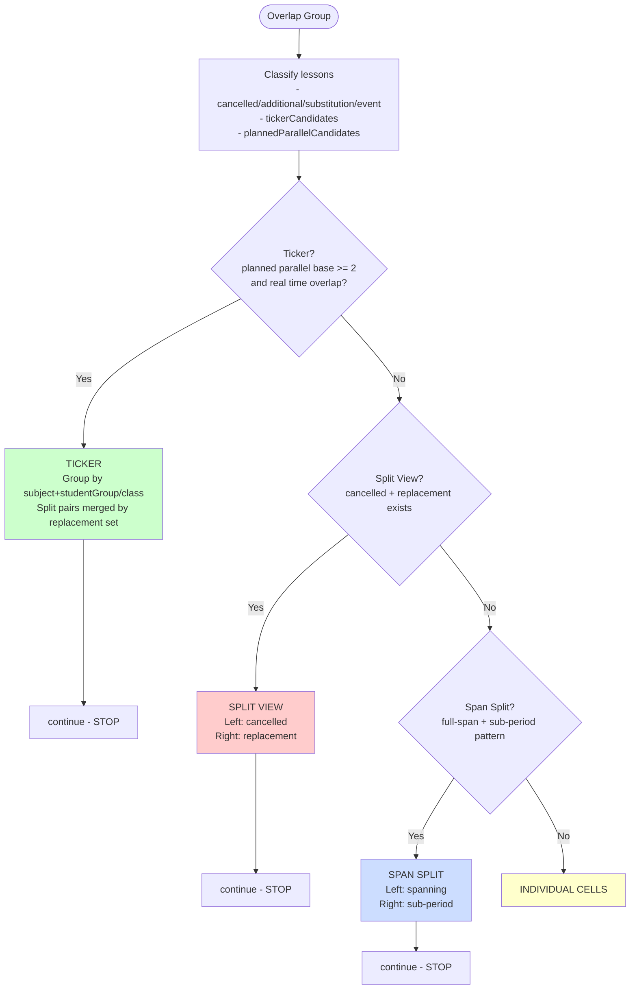

# Grid Widget Rendering Logic

This document describes the **current** rendering logic of the Grid widget in `widgets/grid.js`.

## Overview

Lessons are grouped by overlapping time slots. For each overlap group, exactly one rendering strategy is chosen using `continue` short-circuiting.

## Key Terms

- **Ticker candidates**: lessons with `activityType === NORMAL_TEACHING_PERIOD`
- **Planned parallel base**: ticker candidates with status in `REGULAR | CHANGED | CANCELLED`
- **Split view**: cancelled lesson(s) on the left + replacement lesson(s) on the right
- **Span split**: one lesson spans the full group, others cover sub-periods

## Strategy Order (Actual Code Order)

1. **TICKER** (highest priority)
2. **SPLIT VIEW**
3. **SPAN SPLIT**
4. **INDIVIDUAL CELLS** (fallback)

This order is implemented in `renderLessonCells()`.

## 1) TICKER

Ticker is activated only when there is **real planned parallelism**:

- At least two planned base lessons exist (`REGULAR | CHANGED | CANCELLED`), **and**
- At least one pair of those lessons overlaps in time (`startA < endB && endA > startB`)

So sequential lessons (even if fully replaced by an excursion) do **not** activate ticker.

### Ticker behavior details

- Ticker item grouping key is: `subject + studentGroup/class`
- Teacher is intentionally **not** part of the key
  - Example: Lesson A with teacher change teacher 1 → teacher 2 is rendered as one stacked Lesson-A item
- Split pairs inside ticker are merged by replacement set:
  - If Lesson B, Lesson C, Lesson D are all cancelled and replaced by one replacement event,
    they are rendered as **one** split ticker item:
    - left: three stacked cancelled lessons
    - right: one replacement lesson
- Lesson geometry is preserved (real gaps remain visible); no bridge absorption is used.

## 2) SPLIT VIEW

Used as **standalone split rendering** only when `isSplitView` is true **and** ticker is not active.
If ticker is active, cancelled+replacement is rendered as split content **inside ticker items**, not via this standalone section.

`isSplitView` is true if:

- at least one cancelled lesson exists, and
- replacement exists via one of:
  - `ADDITIONAL`
  - `SUBSTITUTION` with `layoutWidth >= 1000`
  - `EVENT`

Rendering:

- Left: cancelled lesson(s), each at natural top/height
- Right: replacement lesson(s), each at natural top/height
- Remaining non-pair lessons render as individual cells

## 3) SPAN SPLIT

Used when ticker and split view are not active and these conditions match:

- no cancelled lessons
- no added lessons
- at least one lesson spans full candidate range
- at least one lesson is sub-period only

Rendering:

- Left: full-span lesson(s)
- Right: sub-period lesson(s)
- Gaps remain visible

## 4) INDIVIDUAL CELLS

Fallback if none of the above apply.

## Mermaid Flow (Current)

## Important Scenarios

| Scenario | Result |
|---|---|
| Lesson A + Lesson E parallel in period 1/2, teacher change in period 2 | Ticker active, Lesson E stacked in one item |
| Parallel lessons with one cancelled + one replacement | Ticker active, split-view inside ticker item |
| Sequential cancelled lessons fully replaced by one excursion (no planned overlap) | No ticker, split/non-ticker rendering |
| Single cancelled + replacement (no parallel base) | Split view |

## References

- `widgets/grid.js` (source of truth)
- `docs/ARCHITECTURE.md`
- `docs/CONFIG.md`
