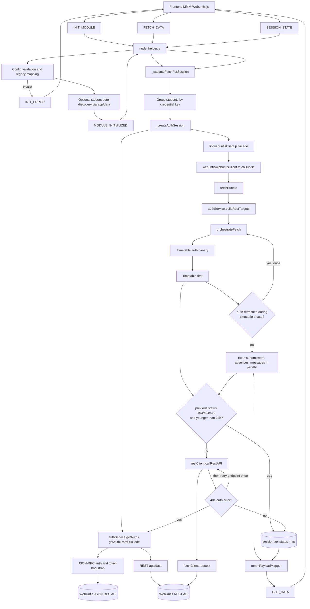
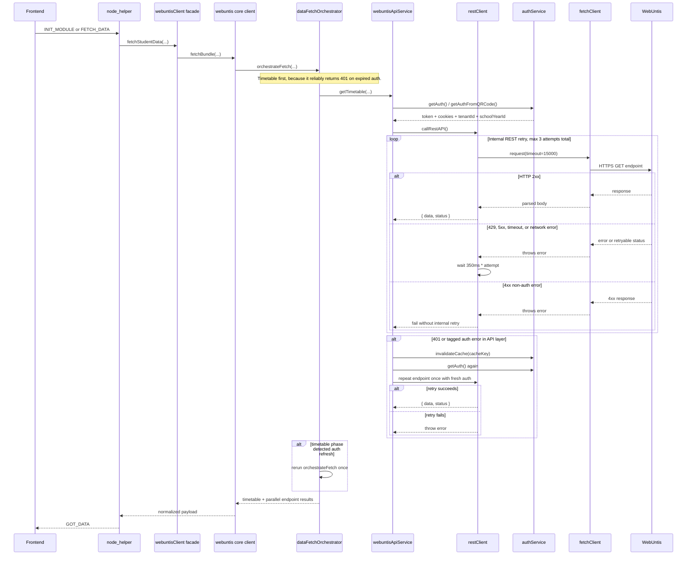

# Server Request Flow

Detailed reference for how MMM-Webuntis performs server requests against WebUntis, which status signals exist, which timeouts apply, and when retries happen.

Primary source files for this document:
- `node_helper.js`
- `lib/webuntisClient.js`
- `lib/webuntis/webuntisClient.js`
- `lib/webuntis/dataFetchOrchestrator.js`
- `lib/webuntis/webuntisApiService.js`
- `lib/webuntis/restClient.js`
- `lib/webuntis/authService.js`
- `lib/webuntis/httpClient.js`
- `lib/webuntis/fetchClient.js`

## Scope

This document focuses on the runtime request flow:
- frontend to backend socket notifications
- backend authentication and request orchestration
- REST and JSON-RPC request paths
- HTTP statuses, warning kinds, and log messages
- timeouts, retries, and skip rules

It complements, but does not replace:
- [ARCHITECTURE.md](ARCHITECTURE.md)
- [API_REFERENCE.md](API_REFERENCE.md)
- [API_V2_MANIFEST.md](API_V2_MANIFEST.md)

## 1. End-to-End Flow

## 2. Single Request Lifecycle

## 3. Socket-Level Status Signals

These are the internal status signals between frontend and backend.

| Signal | Direction | Meaning |
|--------|-----------|---------|
| `INIT_MODULE` | frontend -> backend | Validate config, set up auth service, optionally auto-discover students, then trigger initial fetch |
| `MODULE_INITIALIZED` | backend -> frontend | Initialization finished successfully; includes normalized config, warnings, and students |
| `INIT_ERROR` | backend -> frontend | Initialization failed; includes `errors`, `warnings`, and `severity` |
| `FETCH_DATA` | frontend -> backend | Start a refresh for an already initialized session |
| `GOT_DATA` | backend -> frontend | Final payload after auth, fetch, normalization, and payload building |
| `SESSION_STATE` | frontend -> backend | Mark session as `active` or `paused`; paused sessions ignore fetches |

## 4. Request Phases

### Phase 1: Initialization

1. Frontend sends `INIT_MODULE`.
2. `node_helper.js` applies legacy mappings and validates config.
3. An identifier-scoped `AuthService` instance is created.
4. If parent credentials are present, `app/data` may be used to auto-discover students.
5. Backend emits `MODULE_INITIALIZED`.
6. Backend immediately runs `_handleFetchData()` for the first fetch.

### Phase 2: Auth Session Creation

`node_helper.js` creates an auth session per credential group.

Possible paths:
- QR code auth via `httpClient.authenticateWithQRCode()`
- username/password auth via `httpClient.authenticateWithCredentials()`
- token bootstrap via `httpClient.getBearerToken()`
- metadata enrichment via `authService._fetchAppData()`

Returned auth session fields include:
- `token`
- `cookieString`
- `tenantId`
- `schoolYearId`
- `personId`
- `role`
- `appData`

### Phase 3: Target Resolution

`authService.buildRestTargets()` decides which actual REST target is queried.

Examples:
- student login -> own `personId`
- parent login -> child `studentId`
- teacher login -> own `personId`
- class timetable mode -> resolve class id first, then query timetable as `CLASS`

### Phase 4: Timetable-First Fetch

`dataFetchOrchestrator.orchestrateFetch()` always prefers timetable first when timetable is enabled.

Reason:
- timetable is the auth canary
- several non-timetable endpoints may respond with `200 OK` plus empty arrays when auth is stale
- timetable is expected to return a real `401` when auth expired

Special case:
- if timetable is disabled, but other endpoints are enabled, the orchestrator still runs a timetable auth canary against the first target

### Phase 5: Parallel Fetch

After timetable succeeds, the remaining enabled endpoints run in parallel:
- exams
- homework
- absences
- messages of day

Homework is additionally filtered by the configured past/next-day window after the endpoint returns.

## 5. Timeout Model

### Effective WebUntis Timeouts

| Layer | Function | Timeout | Notes |
|------|----------|---------|-------|
| JSON-RPC auth | `httpClient.authenticateWithQRCode()` | `10000ms` | QR login call and follow-up `api/app/config` use 10s |
| JSON-RPC auth | `httpClient.authenticateWithCredentials()` | `10000ms` | Login request uses 10s |
| Token bootstrap | `httpClient.getBearerToken()` | `10000ms` | `api/token/new` uses 10s |
| REST app/data | `authService._fetchAppData()` | `15000ms` | Uses `fetchClient.get()` |
| General REST | `restClient.callRestAPI()` | `15000ms` | Passes timeout to `fetchClient.request()` |
| Generic defaults | `fetchClient.get/post/request()` | `30000ms` default | Usually overridden by the call sites above |

### Important Timeout Nuances

- `fetchClient.request()` protects the full operation with one `AbortController`, including body parsing. This is used by the REST data endpoints.
- `fetchClient.get()` and `fetchClient.post()` use `fetchWithTimeout()` and then parse the body afterwards. In those paths the timeout primarily covers the fetch call itself.
- `restClient.callRestAPI()` logs a slow-response warning when the response takes more than `10000ms`, even if it still finishes before the `15000ms` hard timeout.

## 6. Retry Rules

### Internal REST Retry in `restClient`

`restClient.callRestAPI()` retries up to `3` total attempts.

Retryable conditions:
- HTTP `429`
- HTTP `5xx`
- network errors such as `ECONNREFUSED`, `ETIMEDOUT`, `ECONNRESET`, `EHOSTUNREACH`, `ENOTFOUND`, `EAI_AGAIN`
- `ERR_NETWORK`, `ERR_SOCKET_CONNECTION_TIMEOUT`, `ERR_CONNECTION_REFUSED`, `ABORT_ERR`
- textual fallbacks such as `fetch failed`, `network error`, `timeout`

Backoff:
- after attempt 1 failure: wait `5000ms`
- after attempt 2 failure: wait `15000ms`
- attempt 3 is final

That means the built-in backoff now adds at most `20000ms` before the last failure is returned.

After the third attempt fails, `restClient` does not schedule any further immediate retry. Control returns to the normal fetch lifecycle, and the next regular attempt happens when the frontend fires the next `FETCH_DATA` based on the configured `updateInterval`.

### Auth Retry in `webuntisApiService`

If an endpoint fails with auth semantics, the API layer retries the endpoint once with fresh auth.

Auth-trigger conditions:
- `error.isAuthError === true`
- error code in `AUTH_FAILED`, `SESSION_EXPIRED`, `TOKEN_REQUEST_FAILED`, `TOKEN_INVALID`
- HTTP `401`

Action:
1. call `onAuthError()`
2. invalidate auth cache
3. request fresh auth
4. rerun the same endpoint once

If that second endpoint call still fails, the error is propagated.

### Orchestrator Retry After Timetable Refresh

The fetch orchestrator tracks whether auth was refreshed during the timetable phase.

If that happened, it reruns the whole orchestrated fetch once:
- timetable again
- then all remaining enabled endpoints

Guard:
- this whole-orchestrator rerun happens only once via `_retryAfterAuth`

### Retry on Later Fetch Cycles

Temporary failures are not permanently suppressed.

They are retried on the next normal fetch cycle:
- HTTP `401`
- HTTP `429`
- HTTP `5xx`
- network and timeout failures

## 7. Skip Rules for Permanent Errors

`node_helper.js` stores endpoint status per session in `_apiStatusBySession`.

Permanent statuses:
- `403 Forbidden`
- `404 Not Found`
- `410 Gone`

Behavior:
1. store `{ status, recordedAt }` for the endpoint
2. skip future calls for that endpoint in the same session
3. keep skipping for `24h`
4. after `24h`, clear the stored status and allow a new try

Why this exists:
- avoids repeated calls to endpoints the school or account cannot use
- especially relevant for school licensing gaps such as exams or absences

Important detail:
- `403` is handled gracefully in `webuntisClient`: it returns an empty array and logs that the endpoint will be skipped in future cycles
- `404` and `410` are also recorded and therefore become skip candidates for later fetches

## 8. HTTP Statuses and Their Meaning

### Transport and Request Statuses

| Status / condition | Layer interpretation | Retry? | Future skip? |
|--------------------|----------------------|--------|--------------|
| `200` | success | no | no |
| `201` | success | no | no |
| `204` | success without body | no | no |
| `400` | client request problem | no | no |
| `401` | expired or invalid auth | endpoint retry once with fresh auth | no |
| `403` | permanent permission or licensing problem | no immediate retry | yes, for 24h |
| `404` | endpoint or resource unavailable | no immediate retry | yes, for 24h |
| `410` | endpoint/resource gone | no immediate retry | yes, for 24h |
| `429` | rate limited | yes, internal REST retry | no |
| `500` | server-side error | yes, internal REST retry | no |
| `502` | bad gateway | yes, internal REST retry | no |
| `503` | service unavailable | yes, internal REST retry and later fetch cycles | no |
| timeout or network error | connection problem | yes, internal REST retry | no |

### Warning Metadata Kinds

`node_helper.js` classifies warnings into deterministic kinds for frontend/UI consumers.

| Kind | Typical trigger | Severity |
|------|-----------------|----------|
| `network` | timeout, DNS, refused connection, unreachable host | `critical` |
| `auth` | `401`, `AUTH_FAILED`, `SESSION_EXPIRED`, `TOKEN_INVALID` | `critical` |
| `rate_limit` | `429` | `warning` |
| `server` | `5xx` | `critical` |
| `client` | other `4xx`; `403` is a warning, others critical | `warning` or `critical` |
| `generic` | fallback when nothing matches | `warning` |

## 9. Actual Status and Log Messages

### REST transport log messages from `restClient.callRestAPI()`

| Trigger | Message |
|---------|---------|
| timeout / aborted request | `Connection timeout to WebUntis server "<server>" after <timeout>ms: check network or try again` |
| network / DNS / refused connection | `Cannot connect to WebUntis server "<server>": check server name and network` |
| other transport or HTTP failure | `REST API call failed: <error message>` |

### User-facing warning texts from `convertRestErrorToWarning()`

| Trigger | Warning text |
|---------|--------------|
| `403` | `Endpoint not available for "<student>": your school may not have licensed this feature.` |
| `401` | `Authentication failed for "<student>": Invalid credentials or insufficient permissions.` |
| network / timeout | `Cannot connect to WebUntis server "<server>". Check server name and network connection.` |
| `503` | `WebUntis API temporarily unavailable (HTTP 503). Retrying on next fetch...` |
| generic `4xx` | `HTTP <status> error for "<student>": ...` |
| generic `5xx` | `Server error (HTTP <status>): ...` |

### Operational log messages worth knowing

| Situation | Typical log message |
|----------|---------------------|
| slow REST response | `Slow API response: <path> took <elapsed>ms (timeout: <timeout>ms)` |
| internal REST retry | `[REST] GET <path> failed on attempt X/3 (...), retrying in <backoff>ms` |
| timeout after retries | `Connection timeout to WebUntis server "<server>" after <timeout>ms: check network or try again` |
| network failure | `Cannot connect to WebUntis server "<server>": check server name and network` |
| auth refresh | `[<endpoint>] Authentication token expired, invalidating cache and retrying...` |
| successful auth refresh | `[<endpoint>] Token refresh successful: <n> items` |
| permanent 403 | `[<endpoint>] HTTP 403 - endpoint not available ... Skipping in future cycles.` |
| timetable auth refresh rerun | `[fetch] Auth refresh detected during timetable fetch, retrying all data types with fresh token` |

## 10. Practical Reading Guide

When you debug request issues, the fastest reading order is:

1. `node_helper.js`
2. `lib/webuntis/webuntisClient.js`
3. `lib/webuntis/dataFetchOrchestrator.js`
4. `lib/webuntis/webuntisApiService.js`
5. `lib/webuntis/restClient.js`
6. `lib/webuntis/authService.js`
7. `lib/webuntis/httpClient.js`
8. `lib/webuntis/fetchClient.js`

That order follows the exact control flow from socket event to HTTPS call.

## 11. Summary

The server request model is intentionally layered:

1. `node_helper.js` controls sessions, initialization, grouping, and status memory.
2. `webuntisClient.js` decides which endpoint to call and how to classify failures.
3. `dataFetchOrchestrator.js` enforces timetable-first auth validation and one controlled rerun after auth refresh.
4. `webuntisApiService.js` performs one auth-based endpoint retry.
5. `restClient.js` performs transport retries for rate limits, server failures, and network issues.
6. `authService.js` caches tokens for 14 minutes with a 5-minute safety buffer to avoid stale-token requests.

This combination gives the module three distinct stability layers:
- proactive auth avoidance through token buffering
- reactive endpoint retry on auth refresh
- transport retry for temporary REST and network failures

At the same time, permanent endpoint failures are remembered per session for 24 hours so the module does not keep calling APIs that are unavailable for the current school or account.
