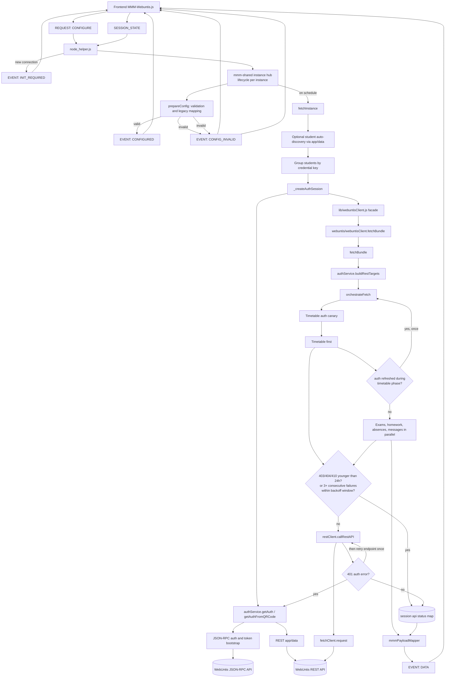
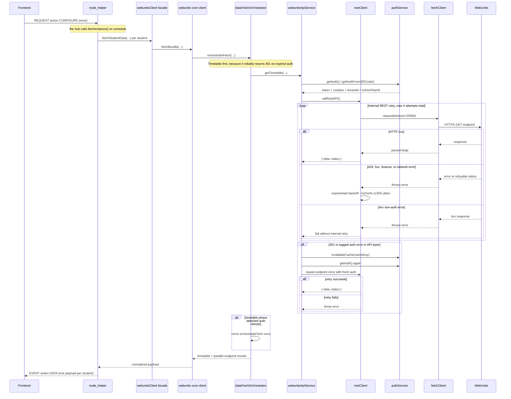

# Server Request Flow

Detailed reference for how MMM-Webuntis performs server requests against WebUntis, which status signals exist, which timeouts apply, and when retries happen.

Primary source files for this document:
- `node_helper.js`
- `lib/webuntisClient.js`
- `lib/webuntis/webuntisClient.js`
- `lib/webuntis/dataFetchOrchestrator.js`
- `lib/webuntis/webuntisApiService.js`
- `lib/webuntis/restClient.js`
- `lib/webuntis/authService.js`
- `lib/webuntis/httpClient.js`
- `lib/webuntis/fetchClient.js`

## Scope

This document focuses on the runtime request flow:
- frontend to backend socket notifications
- backend authentication and request orchestration
- REST and JSON-RPC request paths
- HTTP statuses, warning kinds, and log messages
- timeouts, retries, and skip rules

It complements, but does not replace:
- [ARCHITECTURE.md](ARCHITECTURE.md)
- [API_REFERENCE.md](API_REFERENCE.md)
- [API_V3_MANIFEST.md](API_V3_MANIFEST.md)

## 1. End-to-End Flow

```mermaid
flowchart TD
    FE[Frontend MMM-Webuntis.js]
    NH[node_helper.js]
    INIT[REQUEST: CONFIGURE]
    STATE[SESSION_STATE]
    MODOK[EVENT: CONFIGURED]
    GOT[EVENT: DATA]
    INITERR[EVENT: CONFIG_INVALID]
    INITREQ[EVENT: INIT_REQUIRED]
    HUB[mmm-shared instance hub\nlifecycle per instance]

    CFG[prepareConfig: validation and legacy mapping]
    DISCOVER[Optional student auto-discovery via app/data]
    EXEC[fetchInstance]
    GROUP[Group students by credential key]
    AUTHSESSION[_createAuthSession]

    FACADE[lib/webuntisClient.js facade]
    CLIENT[webuntis/webuntisClient.fetchBundle]
    BUNDLE[fetchBundle]
    TARGETS[authService.buildRestTargets]
    ORCH[orchestrateFetch]
    CANARY[Timetable auth canary]
    TTABLE[Timetable first]
    PAR[Exams, homework, absences, messages in parallel]
    MAP[mmmPayloadMapper]

    AUTH[authService.getAuth / getAuthFromQRCode]
    JSONRPC[JSON-RPC auth and token bootstrap]
    APPDATA[REST app/data]
    RESTCALL[restClient.callRestAPI]
    FETCHC[fetchClient.request]

    STATUS[(session api status map)]
    SKIP{403/404/410 younger than 24h?\nor 3+ consecutive failures\nwithin backoff window?}
    REAUTH{401 auth error?}
    RETRYORCH{auth refreshed during\ntimetable phase?}

    API[(WebUntis REST API)]
    RPC[(WebUntis JSON-RPC API)]

    FE --> INIT --> NH --> HUB --> CFG
    CFG -- invalid --> INITERR --> FE
    CFG -- valid --> MODOK --> FE
    HUB -- on schedule --> EXEC
    NH -- new connection --> INITREQ --> FE
    FE --> STATE --> NH

    EXEC --> DISCOVER --> GROUP --> AUTHSESSION --> FACADE
    FACADE --> CLIENT
    CLIENT --> BUNDLE --> TARGETS --> ORCH

    ORCH --> CANARY
    CANARY --> TTABLE
    TTABLE --> RETRYORCH
    RETRYORCH -- yes, once --> ORCH
    RETRYORCH -- no --> PAR
    PAR --> MAP --> GOT --> FE

    AUTHSESSION --> AUTH
    AUTH --> JSONRPC --> RPC
    AUTH --> APPDATA --> API

    TTABLE --> SKIP
    PAR --> SKIP
    SKIP -- yes --> STATUS
    SKIP -- no --> RESTCALL --> FETCHC --> API
    RESTCALL --> REAUTH
    REAUTH -- yes --> AUTH
    REAUTH -- then retry endpoint once --> RESTCALL
    REAUTH -- no --> STATUS
    STATUS --> MAP

    CFG -- invalid --> INITERR --> FE
```

## 2. Single Request Lifecycle

```mermaid
sequenceDiagram
    participant FE as Frontend
    participant NH as node_helper
    participant WF as webuntisClient facade
    participant WC as webuntis core client
    participant OR as dataFetchOrchestrator
    participant API as webuntisApiService
    participant RC as restClient
    participant AU as authService
    participant FC as fetchClient
    participant WU as WebUntis

    FE->>NH: REQUEST action CONFIGURE (once)
    Note over NH: the hub calls fetchInstance() on schedule
    NH->>WF: fetchStudentData(...) per student
    WF->>WC: fetchBundle(...)
    WC->>OR: orchestrateFetch(...)

    Note over OR: Timetable first, because it reliably returns 401 on expired auth.

    OR->>API: getTimetable(...)
    API->>AU: getAuth() / getAuthFromQRCode()
    AU-->>API: token + cookies + tenantId + schoolYearId
    API->>RC: callRestAPI()

    loop Internal REST retry, max 4 attempts total
        RC->>FC: request(timeout=25000)
        FC->>WU: HTTPS GET endpoint
        alt HTTP 2xx
            WU-->>FC: response
            FC-->>RC: parsed body
            RC-->>API: { data, status }
        else 429, 5xx, timeout, or network error
            WU-->>FC: error or retryable status
            FC-->>RC: throws error
            RC->>RC: exponential backoff ~1s/2s/4s (±25% jitter)
        else 4xx non-auth error
            WU-->>FC: 4xx response
            FC-->>RC: throws error
            RC-->>API: fail without internal retry
        end
    end

    alt 401 or tagged auth error in API layer
        API->>AU: invalidateCache(cacheKey)
        API->>AU: getAuth() again
        API->>RC: repeat endpoint once with fresh auth
        alt retry succeeds
            RC-->>API: { data, status }
        else retry fails
            RC-->>API: throw error
        end
    end

    alt timetable phase detected auth refresh
        OR->>OR: rerun orchestrateFetch once
    end

    OR-->>WC: timetable + parallel endpoint results
    WC-->>NH: normalized payload
    NH-->>FE: EVENT action DATA (one payload per student)
```

## 3. Socket-Level Status Signals

These are the internal status signals between frontend and backend.

| Signal | Direction | Meaning |
|--------|-----------|---------|
| `CONFIGURE` | frontend -> backend | Sent once (and again on `INIT_REQUIRED`): the full config. The backend validates it, starts the instance and its fetch schedule |
| `SESSION_STATE` | frontend -> backend | Mark the display as `active` or `paused`; with `backgroundRefresh: false` the backend stops fetching while every display is paused |
| `CONFIGURED` | backend -> frontend | Config accepted; carries config `warnings`/`warningMeta` and the plugin `plugins` registry. Sent before the first fetch |
| `DATA` | backend -> frontend | Result of one fetch cycle: `students` (one payload per student), `allFailed`, module-level `warnings`. Replayed to a display that connects later |
| `FETCH_FAILED` | backend -> frontend | The fetch threw as a whole; the frontend keeps its data and shows the message. The retry follows the backoff |
| `CONFIG_INVALID` | backend -> frontend | Validation failed; `error.details.errors` lists every error, `error.details.warnings` the warnings |
| `CONFIG_REJECTED` | backend -> frontend | Only to the display concerned: its credentials or students differ from the running instance (`data.mismatchKeys`) |
| `INIT_REQUIRED` | backend -> frontend | A new socket connected or the instance is unknown (helper restarted). `identifier` is `*` for every instance; the frontend re-sends `CONFIGURE` and `SESSION_STATE` |

## 4. Request Phases

### Phase 1: Initialization

1. Frontend sends `CONFIGURE`.
2. `prepareConfig()` applies legacy mappings and validates the config (`CONFIG_INVALID` otherwise).
3. The process-wide `AuthService` is shared by all module instances.
4. The hub sends `CONFIGURED` and starts the lifecycle, which runs the first `fetchInstance()` right away.
5. `fetchInstance()` first runs the student discovery when parent credentials are present without
   configured students (`app/data`, may log in). A failed discovery becomes a module-level warning in
   `DATA` and is retried by the next fetch (2 min, then doubling).

### Phase 2: Auth Session Creation

`node_helper.js` creates an auth session per credential group. The group key
(`_getCredentialKey()`) is the credential fingerprint only — `parent:<user>@<server>/<school>`,
`user:<user>@<server>/<school>` or `qrcode:<url>` — and is deliberately not scoped by module
instance, browser session or `carouselId`: every consumer of the same account shares one
WebUntis session and one login. Fetches of different instances with the same key are serialized
(`_pendingFetchByCredKey`), parallel logins are deduplicated inside `AuthService` (`_pendingAuth`).
A session that follows another one of the same account reuses its responses
(`lib/webuntis/responseCache.js`, keyed by account, server, endpoint, school year and
parameters): for 80 % of its own `updateInterval`, at most 4 minutes. Several instances with one
account (e.g. one per carousel slide) therefore cost about one set of requests per interval
instead of one per instance. Failed responses are never reused.
On shutdown `stop()` logs every cached session out (`AuthService.logoutAll()`).

Possible paths:
- QR code auth via `httpClient.authenticateWithQRCode()`
- username/password auth via `httpClient.authenticateWithCredentials()`
- token bootstrap via `httpClient.getBearerToken()`
- metadata enrichment via `authService._fetchAppData()`

Note on `app/data`: a `200` response with an empty or non-JSON body does **not** fail authentication. `tenantId` and `schoolYearId` stay `null`, the result is cached for the full token TTL, and subsequent REST calls are sent without the `Tenant-Id` / `X-Webuntis-Api-School-Year-Id` headers.

Returned auth session fields include:
- `token`
- `cookieString`
- `tenantId`
- `schoolYearId`
- `personId`
- `role`
- `appData`

### Phase 3: Target Resolution

`authService.buildRestTargets()` decides which actual REST target is queried.

Examples:
- student login -> own `personId`
- parent login -> child `studentId`
- teacher login -> own `personId`
- class timetable mode -> resolve class id first, then query timetable as `CLASS`

### Phase 4: Timetable-First Fetch

`dataFetchOrchestrator.orchestrateFetch()` always prefers timetable first when timetable is enabled.

Reason:
- timetable is the auth canary
- several non-timetable endpoints may respond with `200 OK` plus empty arrays when auth is stale
- timetable is expected to return a real `401` when auth expired

Special case:
- if timetable is disabled, but other endpoints are enabled, the orchestrator still runs a timetable auth canary against the first target

Skipping the check: when the timetable endpoint has vouched for the account's token within the last
10 seconds (`authService.wasTimetableRecentlyVerified()`, e.g. the previous student of the same
account), the orchestrator starts the other endpoints together with the timetable instead of after it.
That saves one round trip per further student. If the timetable call then reports an auth refresh, the
requests already sent with the old token are awaited and the whole fetch runs again once, as before.

### Phase 5: Parallel Fetch

After timetable succeeds, the remaining enabled endpoints run in parallel:
- exams
- homework
- absences
- messages of day

Homework is additionally filtered by the configured past/next-day window after the endpoint returns.

Students of one account: `fetchInstance()` groups the students by credential key. Inside a group the
first student is fetched alone (it checks login and token, timetable first); the others follow with at
most `STUDENT_FETCH_CONCURRENCY` (3) at a time. Payloads keep the configuration order. Groups of the same
account from different instances are still serialized (`_pendingFetchByCredKey`), and identical
instances (for example the same content on two Carousel pages) are answered from `responseCache`.
Measured with the production account: one instance and two identical instances cost the same number of
WebUntis requests (9 for the first cycle including the login, 5 for each following cycle). With one
student that only needs the timetable, or with two students, the parallelism gains nothing measurable
(about 0.22 s for a warm fetch with two students, before and after); it helps from three students on and
for students that also fetch exams, homework or absences.

Teacher-target note:
- For `TEACHER` targets, the runtime skips `exams`, `homework`, and `absences` because the currently integrated REST wrappers are student-scoped and may otherwise return server-side 5xx errors.
- `messages of day` remains enabled for teacher targets because it is not student-scoped.

## 5. Timeout Model

### Effective WebUntis Timeouts

| Layer | Function | Timeout | Notes |
|------|----------|---------|-------|
| JSON-RPC auth | `httpClient.authenticateWithQRCode()` | `10000ms` | QR login call and follow-up `api/app/config` use 10s |
| JSON-RPC auth | `httpClient.authenticateWithCredentials()` | `10000ms` | Login request uses 10s |
| Token bootstrap | `httpClient.getBearerToken()` | `10000ms` | `api/token/new` uses 10s |
| REST app/data | `authService._fetchAppData()` | `25000ms` | Uses `fetchClient.get()` with `API_TIMEOUT_MS` |
| General REST | `restClient.callRestAPI()` | `25000ms` | `API_TIMEOUT_MS` from `transportConstants.js`, passed to `fetchClient.request()` |
| Generic defaults | `fetchClient.get/post/request()` | `30000ms` default | Usually overridden by the call sites above |

### Measured WebUntis Session Lifetimes (2026-09-18, `bachgymnasium.webuntis.com`)

| Credential | Lifetime | Behaviour after expiry |
|------------|----------|------------------------|
| Bearer JWT | 900s from issue (`exp - iat`) | `timetable/entries` → `401` |
| Classic session cookie (`/api/exams`, `/api/homeworks/lessons`, `/api/classreg/absences/students`, `api/token/new`) | idle timeout between 4 and 6 min | `302 → /WebUntis/index.do` (or `200` + login state / HTML) — surfaced as `SESSION_EXPIRED`, which triggers a re-login |
| REST session (`timetable/entries`, cookie + JWT) | idle timeout between 8 and 10 min | `401` |

Additional measurements (2026-09-29, same server):

| Experiment | Result |
|------------|--------|
| `token/new` and `app/data` response headers | no new `JSESSIONID`, only a `traceId` cookie: neither call extends the classic session |
| `token/new` with a valid cookie, three times in a row | a new token each time, `exp` = now + 15 min (`exp - iat` = 900 s) |
| Session used every 5 min through `app/data` only (REST), token renewal at 10 and 15 min | renewal fails with `SESSION_EXPIRED`; at 16 min `app/data` answers `401`. REST activity does not keep the classic cookie alive |
| Session idle for 10 min, then `token/new` | `SESSION_EXPIRED` |
| Session kept alive with a JSON-RPC call (`getLatestImportTime`) every 4 min, `token/new` at 16 min | works. A JSON-RPC call extends the classic session |

The REST session (timetable) idles out earlier than the table above says: with a 5 minute
`updateInterval` (±10 % jitter) fetches after 4:31, 4:40, 4:51 and 4:56 minutes worked, fetches after
5:17 and 5:20 got a `401`. Treat the idle limit as about five minutes, not eight to ten. With a five
minute interval about every other fetch therefore starts with a `401` and a recovery login; the recovery
path above is normal operation, not an error. The default `updateInterval` is therefore 4 minutes: with
the ±10 % jitter the longest gap is 4:24, below the gaps that worked in the measurement (up to 4:56), so a
single instance keeps its session warm and the recovery login only happens after a real interruption. Token renewal (`token/new`) worked at minute 14 of a session
because the fetches use the classic endpoints (exams, homework, absences), which keep the cookie warm.

Decision: no keep-alive ping. A JSON-RPC call would keep the cookie alive, but the classic session
idles out after about five minutes, so a ping every ~3 minutes would cost more requests (about five per
15-minute token lifetime) than the login it saves (three). JSON-RPC stays what it is here: the way to get
the session cookie. Data is read through the REST APIs only.

Consequences: the timetable-first auth canary only covers the JWT/REST session. Between ~5 and ~9
minutes of inactivity the timetable still succeeds while exams, homework and absences hit the dead
cookie; each of them now raises `SESSION_EXPIRED` and retries once after a shared re-login. Several
parallel logins of the same user do **not** invalidate each other, and `logout` only ends the
session it is sent from.

### Important Timeout Nuances

- `fetchClient.request()` protects the full operation with one `AbortController`, including body parsing. This is used by the REST data endpoints.
- `fetchClient.get()` and `fetchClient.post()` use `fetchWithTimeout()` and then parse the body afterwards. In those paths the timeout primarily covers the fetch call itself.
- `restClient.callRestAPI()` logs a slow-response warning when the response takes more than `10000ms`, even if it still finishes before the `25000ms` hard timeout.

## 6. Retry Rules

### Internal REST Retry in `restClient`

`restClient.callRestAPI()` retries up to `4` total attempts with **exponential backoff + jitter**.

Retryable conditions:
- HTTP `429`, `500`, `502`, `503`, `504` (server errors, excluding `501`)
- HTTP `5xx` (except `501 Not Implemented`)
- network errors such as `ECONNREFUSED`, `ETIMEDOUT`, `ECONNRESET`, `EHOSTUNREACH`, `ENOTFOUND`, `EAI_AGAIN`, `ERR_NETWORK`, `ERR_SOCKET_CONNECTION_TIMEOUT`, `ERR_CONNECTION_REFUSED`, `ERR_HTTP_REQUEST_TIMEOUT`, `ABORT_ERR`
- textual fallbacks such as `fetch failed`, `network error`, `timeout`, `connection reset`

**Backoff Strategy** (exponential with ±25% jitter):
- after attempt 1 failure: wait ~1000ms (±250ms)
- after attempt 2 failure: wait ~2000ms (±500ms)
- after attempt 3 failure: wait ~4000ms (±1000ms)
- attempt 4 is final

The jitter (±25%) helps prevent the "thundering herd" problem where multiple clients hammer the server simultaneously when recovering. The built-in backoff adds at most ~7 seconds total before the final failure is returned.

After the fourth and final attempt fails, `restClient` does not schedule any further immediate retry. Control returns to the normal fetch lifecycle, and the next regular attempt happens when the backend's fetch schedule (the mmm-shared instance hub) fires the next fetch based on the configured `updateInterval`; a failed fetch is retried earlier with backoff (2 minutes, doubling up to 30).

### Auth Retry in `webuntisApiService`

If an endpoint fails with auth semantics, the API layer retries the endpoint once with fresh auth.

Auth-trigger conditions (`errorHandler.isAuthError()`):
- `error.isAuthError === true`
- error code in `AUTH_FAILED`, `SESSION_EXPIRED`, `TOKEN_REQUEST_FAILED`, `TOKEN_INVALID`
- HTTP `401`

Where `SESSION_EXPIRED` comes from:
- `fetchClient` never follows redirects; a `3xx` to `/WebUntis/index.do` (dead session cookie on
  the classic `/api/*` endpoints) is thrown as `SESSION_EXPIRED`
- `restClient` throws `SESSION_EXPIRED` when a `200` body is the login state
  (`{"loginError":"","state":"LOGIN_ERROR"}`) or an HTML document
- `httpClient.getBearerToken()` throws it when `api/token/new` answers with HTML

If the re-login itself fails, the resulting error keeps `isAuthError`; `node_helper._extractHttpStatus()`
records it as `401` even though JSON-RPC reports rejected logins inside a `200` body, and
`convertRestErrorToWarning()` emits an authentication warning. The frontend therefore preserves
its previous data instead of rendering an empty plan.

Action:
1. call `onAuthError()`
2. invalidate auth cache
3. request fresh auth
4. rerun the same endpoint once

If that second endpoint call still fails, the error is propagated.

Several endpoints of one fetch (timetable, exams, homework, absences, and the "run everything again"
round after a timetable refresh) hit the dead session at the same moment and each asks for fresh auth.
`AuthService` shares one login among callers that wait for it. If that login **fails**, its error
answers every further request for the same account for 30 seconds (`LOGIN_FAILURE_COOLDOWN_MS`) instead of
starting another attempt; the cooldown ends on the next successful login. The hub's own retry (2 minutes,
doubling) is separate.

History (2026-09-29): this login used to fail every time for username/password accounts, and one failure
was followed by about eight attempts within a second, each answered `200 - bad credentials`. Cause: the
auth session kept the user name but not the password, so the REST layer logged in again with
`password: null`. `createAuthSession()` now keeps the password in the session (it stays in the backend and
is never part of a payload). Before that fix a dead REST session cost a whole fetch cycle: the recovery
login failed, the circuit breaker (below) then kept the timetable away, and the next cycle logged in
normally. A raw login right after a dead session (also right after the `401`) always worked in a test.

### Orchestrator Retry After Timetable Refresh

The fetch orchestrator tracks whether auth was refreshed during the timetable phase.

If that happened, it reruns the whole orchestrated fetch once:
- timetable again
- then all remaining enabled endpoints

Guard:
- this whole-orchestrator rerun happens only once via `_retryAfterAuth`

### Retry on Later Fetch Cycles

Temporary failures are not permanently suppressed.

They are retried on the next normal fetch cycle:
- HTTP `401`
- HTTP `429`
- HTTP `5xx`
- network and timeout failures

Repeated temporary failures of the *same* endpoint are throttled by the circuit breaker described
in section 7.2.

## 7. Skip Rules

`node_helper.js` stores endpoint status per session in `_apiStatusBySession` as
`{ status, recordedAt, failureCount }`.

Two independent skip mechanisms act on that record.

### 7.1 Permanent Errors

Permanent statuses:
- `403 Forbidden`
- `404 Not Found`
- `410 Gone`

Behavior:
1. store the status for the endpoint
2. skip future calls for that endpoint in the same session — immediately, no threshold
3. keep skipping for `24h`
4. after `24h`, clear the stored status and allow a new try

Why this exists:
- avoids repeated calls to endpoints the school or account cannot use
- especially relevant for school licensing gaps such as exams or absences

Important detail:
- `403` is recorded in `webuntisClient._executeRestEndpoint()` and then propagated, so the orchestrator's `wrapAsync()` returns the empty default **and** adds the user-facing warning
- on every skipped cycle the endpoint re-raises a `quiet` 403 error, which keeps the warning in the payload (the frontend only shows non-critical warnings that persist across payloads) without logging an error each time and without resetting the 24h window
- `404` and `410` are also recorded and therefore become skip candidates for later fetches

### 7.2 Circuit Breaker for Repeated Temporary Errors

A single `5xx` is a blip and must stay retryable. But WebUntis can serve a constant `500` for weeks —
for example during holidays, when students hold no class assignment. Without a breaker, every fetch
cycle would burn the full internal retry ladder (4 attempts with backoff) on a result that will not
change.

Behavior:
1. `_recordApiStatusFromError()` increments `failureCount` for **consecutive** failures; an
   intervening success restarts the count
2. below `TRANSIENT_FAILURE_THRESHOLD` (3) nothing is skipped — isolated failures are retried on the
   very next cycle, unchanged
3. from the third consecutive failure, `_shouldSkipApi()` suppresses calls within a growing window:
   `15min` → `1h` → `6h`, capped at the last step
4. once the window elapses, exactly one probe is allowed through; if it fails, the breaker escalates
   to the next step instead of restarting at `15min`
5. any success resets `failureCount` to `0` and closes the breaker

This applies to every non-permanent, non-success status, including `failureCount` accumulated from
errors that carry no HTTP status at all.

**Exception: auth failures (status `401`: expired session, rejected login) do not count.** They heal with
the next login and happen every few minutes with a short `updateInterval`, so they are not a sign that
the endpoint is broken. The `401` is still recorded as the endpoint's status (the widgets show
"unavailable" and keep old data), but `failureCount` is left as it was. Before, three timetable
failures within one fetch (the retry rounds) opened the breaker, and the timetable stayed away for about
ten minutes even though the next login had worked, while exams, homework and absences came back
(observed 2026-09-29, `Backing off after 3 consecutive failures (status 401)`).

Skips are graceful: `webuntisClient._executeRestEndpoint()` returns an empty array, exactly as for
permanent errors — no exception reaches the payload builder.

## 8. HTTP Statuses and Their Meaning

### Transport and Request Statuses

| Status / condition | Layer interpretation | Retry? | Future skip? |
|--------------------|----------------------|--------|--------------|
| `200` | success | no | no |
| `200` with login-state JSON or HTML body | `SESSION_EXPIRED` (auth error) | endpoint retry once with fresh auth | no |
| `200` timetable body without `days[]` | `INVALID_RESPONSE`; recorded as status `0`, warning emitted, previous data preserved by the frontend | no | after 3 consecutive failures (breaker) |
| `3xx` to `/WebUntis/index.do` | `SESSION_EXPIRED` (auth error); redirects are never followed | endpoint retry once with fresh auth | no |
| `201` | success | no | no |
| `204` | success without body | no | no |
| `400` | client request problem | no | no |
| `401` | expired or invalid auth; also recorded for rejected re-logins (JSON-RPC error inside a `200` body) | endpoint retry once with fresh auth | no |
| `403` | permanent permission or licensing problem | no immediate retry | yes, for 24h |
| `404` | endpoint or resource unavailable | no immediate retry | yes, for 24h |
| `410` | endpoint/resource gone | no immediate retry | yes, for 24h |
| `429` | rate limited | yes, internal REST retry | after 3 consecutive failures (breaker) |
| `500` | server-side error | yes, internal REST retry | after 3 consecutive failures (breaker) |
| `502` | bad gateway | yes, internal REST retry | after 3 consecutive failures (breaker) |
| `503` | service unavailable | yes, internal REST retry and later fetch cycles | after 3 consecutive failures (breaker) |
| timeout or network error | connection problem | yes, internal REST retry | after 3 consecutive failures (breaker) |

"Breaker" refers to the circuit breaker in section 7.2: the skip starts only after three consecutive
failures of the same endpoint and lasts `15min` → `1h` → `6h`, not `24h` as for permanent errors.
Any success closes it immediately.

### Warning Metadata Kinds

`node_helper.js` classifies warnings into deterministic kinds for frontend/UI consumers.

| Kind | Typical trigger | Severity |
|------|-----------------|----------|
| `network` | timeout, DNS, refused connection, unreachable host | `critical` |
| `auth` | `401`, `AUTH_FAILED`, `SESSION_EXPIRED`, `TOKEN_INVALID` | `critical` |
| `rate_limit` | `429` | `warning` |
| `server` | `5xx` | `critical` |
| `client` | other `4xx`; `403` is a warning, others critical | `warning` or `critical` |
| `generic` | fallback when nothing matches | `warning` |

## 9. Actual Status and Log Messages

### REST transport log messages from `restClient.callRestAPI()`

| Trigger | Message |
|---------|---------|
| timeout / aborted request | `Connection timeout to WebUntis server "<server>" after <timeout>ms: check network or try again` |
| network / DNS / refused connection | `Cannot connect to WebUntis server "<server>": check server name and network` |
| other transport or HTTP failure | `REST API call failed: <error message>` |

### User-facing warning texts from `convertRestErrorToWarning()`

| Trigger | Warning text |
|---------|--------------|
| `403` | `Endpoint not available for "<student>": your school may not have licensed this feature.` |
| `SESSION_EXPIRED` | `WebUntis session expired for "<student>". Re-login is attempted on the next fetch.` |
| rejected re-login (`AUTH_FAILED` etc.) | `Authentication failed for "<student>": <message>` |
| `INVALID_RESPONSE` | `WebUntis returned an unusable response for "<student>": ...` |
| `401` | `Authentication failed for "<student>": Invalid credentials or insufficient permissions.` |
| network / timeout | `Cannot connect to WebUntis server "<server>". Check server name and network connection.` |
| `503` | `WebUntis API temporarily unavailable (HTTP 503). Retrying on next fetch...` |
| generic `4xx` | `HTTP <status> error for "<student>": ...` |
| generic `5xx` | `Server error (HTTP <status>): ...` |

### Operational log messages worth knowing

| Situation | Typical log message |
|----------|---------------------|
| slow REST response | `Slow API response: <path> took <elapsed>ms (timeout: <timeout>ms)` |
| internal REST retry | `[REST] GET <path> failed on attempt X/4 (...), retrying in <backoff>ms` |
| timeout after retries | `Connection timeout to WebUntis server "<server>" after <timeout>ms: check network or try again` |
| network failure | `Cannot connect to WebUntis server "<server>": check server name and network` |
| auth refresh | `[<endpoint>] Authentication token expired, invalidating cache and retrying...` |
| successful auth refresh | `[<endpoint>] Token refresh successful: <n> items` |
| permanent 403 | `[<endpoint>] HTTP 403 - endpoint not available ... Skipping in future cycles.` |
| timetable auth refresh rerun | `[fetch] Auth refresh detected during timetable fetch, retrying all data types with fresh token` |

## 10. Practical Reading Guide

When you debug request issues, the fastest reading order is:

1. `node_helper.js`
2. `lib/webuntis/webuntisClient.js`
3. `lib/webuntis/dataFetchOrchestrator.js`
4. `lib/webuntis/webuntisApiService.js`
5. `lib/webuntis/restClient.js`
6. `lib/webuntis/authService.js`
7. `lib/webuntis/httpClient.js`
8. `lib/webuntis/fetchClient.js`

That order follows the exact control flow from socket event to HTTPS call.

## 11. Summary

The server request model is intentionally layered:

1. `node_helper.js` controls sessions, initialization, grouping, and status memory.
2. `webuntisClient.js` decides which endpoint to call and how to classify failures.
3. `dataFetchOrchestrator.js` enforces timetable-first auth validation and one controlled rerun after auth refresh.
4. `webuntisApiService.js` performs one auth-based endpoint retry.
5. `restClient.js` performs transport retries for rate limits, server failures, and network issues.
6. `authService.js` caches one session per credential fingerprint until the token's `exp` (14 minutes without one) with a 60-second safety buffer; the session is shared by every module instance using that account, and any endpoint that sees the login page (`302`, `LOGIN_ERROR`, HTML) forces a re-login.

This combination gives the module three distinct stability layers:
- proactive auth avoidance through token buffering
- reactive endpoint retry on auth refresh
- transport retry for temporary REST and network failures

At the same time, permanent endpoint failures are remembered per session for 24 hours so the module does not keep calling APIs that are unavailable for the current school or account.
